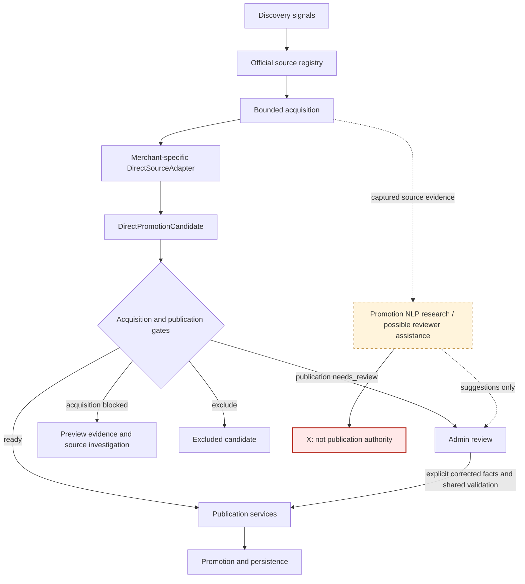
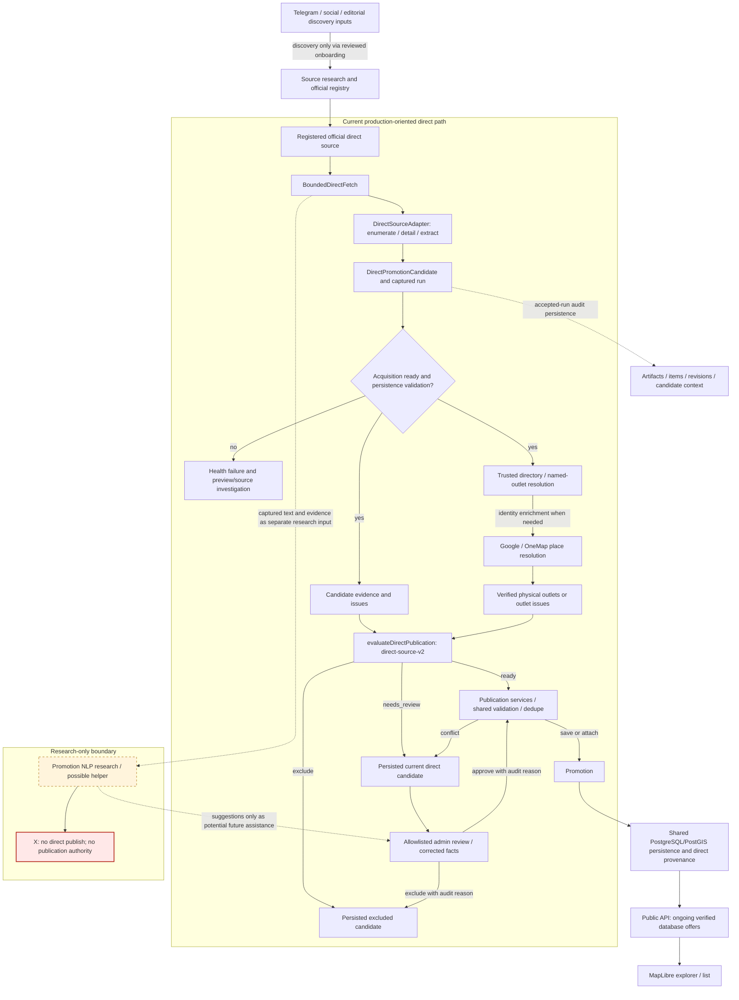

# PromotionAroundYou architecture

## 1. Purpose and status

**`docs/architecture.md` is the current architecture overview.** It describes the
repository implementation inspected on 4 October 2026, using paths and conceptual
boundaries that do not depend on a branch name. Current code is authoritative if a
design record disagrees with it.

[`docs/changes/`](changes/) contains historical design and change records, including
research experiments and proposals. Those records explain individual changes;
they should not be read together as a single current architecture specification.
Their deployment proposals, earlier implementation limits and experiment results
retain their original status.

The current production-oriented ingestion path uses registered official sources,
bounded acquisition, merchant-specific deterministic extraction, verified outlet
resolution and publication services. The web application and administrator UI
share a `Promotion` domain and PostgreSQL/PostGIS persistence with the retained
Telegram ingestion path. Promotion NLP is a separate research module.

“Current” here means implemented in this repository. Registry enablement,
fixture validation and acquisition readiness do not establish a deployed service,
an applied database migration or a running collection schedule. This document makes
no deployment claim.

## 2. High-level architecture



The combined gate is expanded below. **A failed acquisition does not currently
create a direct-candidate admin inbox entry.** Production persistence rejects that
run; preview artifacts support investigation. Publication-incomplete candidates
from an accepted acquisition can be persisted for administrator review. The NLP
suggestion arrow describes a possible assistance role, not an implemented admin
integration.

## 3. Source discovery versus source authority

### Discovery

Telegram, social posts, editorial pages and historical promotion evidence can
identify merchants, promotion URLs, official domains and source patterns.
Discovering a link or a merchant does not verify source ownership, campaign facts
or participating outlets. The separate [source-evidence module](../src/ingestion/source-evidence/)
and [source research records](research/) support this distinction.

The target is **source substitution**:

```text
discovery signal → official merchant source → authoritative direct-source pipeline
```

This is an onboarding/research process, not an automatic runtime operation that
adds discovered URLs to the trusted registry.

### Authority

A [`DirectSourceDefinition`](../src/ingestion/direct-sources/types.ts) records
operator identity, verified/probable/unverified ownership, independent evidence
URLs and a review basis, allowed hosts, exact listing roots and publication policy.
`hasRecordedDirectOwnership()` requires verified ownership, nonempty HTTPS
evidence URLs and a nonempty review. Probable ownership does not pass that gate.
The runtime checks the recorded basis; it does not independently redo the legal
ownership investigation on each run.

The source contract distinguishes merchant websites, issuer platforms and scoped
merchant social accounts. The current registry contains website sources and the
Kris+ issuer platform; it does not register a merchant-social source. Shared-host
social support in [source-scope.ts](../src/ingestion/direct-sources/source-scope.ts)
requires an exact account/content boundary, not trust in an entire social domain.
An issuer's ownership does not by itself establish a partner merchant's campaign
scope or outlet participation.

### Where Telegram fits today

For a mature direct-source merchant, Telegram is a discovery signal and optional
historical provenance; it is not required runtime authority. The direct adapter
does not call `PostOfferParser` or translate merchant HTML into Telegram text.

**The Telegram-first architecture is a historical baseline, but its ingestion
implementation remains available.** [`src/ingestion/runner.ts`](../src/ingestion/runner.ts)
still accepts approved exports, live public-preview collection and pending retries.
[`live.ts`](../src/ingestion/live.ts) collects the selected SG Food Deals and
TasteSoul previews, and [`service.ts`](../src/ingestion/service.ts) processes their
revisions through the legacy deterministic resolution pipeline. That route retains
its own validation and review path; discovery alone never authorizes publication.
[`worker.ts`](../src/ingestion/worker.ts) runs that legacy live collection loop,
not direct-source ingestion. Its presence does not prove it is running.

## 4. Direct-source registry

[`registry.ts`](../src/ingestion/direct-sources/registry.ts), including the appended
[coverage definitions](../src/ingestion/direct-sources/coverage-batch-2-definitions.ts),
is trusted server configuration. It owns:

- Source identity, display label, operator and authority evidence/review.
- Origin, exact allowed hosts and explicit listing roots.
- Adapter key and the checked factory mapping in `sourceAdapter()`.
- Optional acquisition count budgets.
- `activationReview`: recorded enumeration assessment, blockers and evidence
  references for onboarding. This is not a runtime gate bypass.
- `publicationPolicy`: enablement, merchant, category, official-directory outlet
  strategy and automatic publication permission.

These states are distinct:

| State              | Meaning in current code                                                                                                        |
| ------------------ | ------------------------------------------------------------------------------------------------------------------------------ |
| `enabled`          | Production ingest/persistence and direct review may accept this configured source ID. Disabled sources can still be previewed. |
| `autoPublish`      | Automatic publication evaluation is permitted; it still needs every other gate. Manual review is a separate path.              |
| Ownership verified | The registry contains the recorded evidence and review required by `hasRecordedDirectOwnership()`.                             |
| Acquisition ready  | This particular run passed ownership, coverage, fetch and extraction checks without acquisition issues.                        |

Pepper Lunch and Shake Shack currently have both publication flags enabled.
The remaining registered sources are disabled, including verified sources with
unresolved acquisition or publication scope. Dian Xiao Er records probable
ownership. These are code configuration facts, not claims of live activation or
successful publication. Production persistence rereads configuration by source ID
instead of accepting policy supplied by a caller.

## 5. Acquisition boundary

[`BoundedDirectFetch`](../src/ingestion/direct-sources/fetch.ts) combines a network
security boundary with an evidence-acquisition boundary:

- Initial grants are the exact canonicalized registered listing roots. Additional
  URLs must be discovered from anchors in successfully retrieved HTML, with
  adapter-specific selectors and path predicates.
- Every fetch and redirect checks exact allowed hosts and source scope. Transport
  rejects unsafe network targets, checks DNS answers and pins a checked public
  address. It uses HTTPS source scope without caller-provided authentication.
- Requests, listing/detail/evidence pages, redirects, time and response bytes are
  bounded. Accepted content is HTML or PDF; listing pages must be HTML.
- Request attempts retain relations, parent links, redirects and failure codes.
  Captured responses retain raw bytes and evidence metadata: source, requested and
  final URL, relation, observation time, content type/status and content hash.
- Non-listing parents may grant only menu/terms evidence. This is not an arbitrary
  recursive crawler. A fetched page cannot authorize unrestricted traversal.

Current defaults in `fetch.ts` are:

| Budget                                                   | Default         |
| -------------------------------------------------------- | --------------- |
| Total requests, including redirect requests              | 40              |
| Listing pages                                            | 5               |
| Detail pages                                             | 20              |
| Menu/terms evidence pages                                | 8               |
| Response body                                            | 3,000,000 bytes |
| One fetch, including DNS, redirects and body consumption | 12,000 ms       |
| Redirect hops                                            | 3               |

Trusted registry configuration can change count budgets; Shake Shack currently
uses 60 requests and 50 detail pages. Call-level overrides can only tighten the
effective limits. Network safety limits are not configurable by a source.

Successful HTTP retrieval does not establish complete enumeration, an offer's
semantic association or publication completeness. PDF capture also does not imply
that its campaign facts have been decoded; the current
[PDF helper](../src/ingestion/direct-sources/pdf.ts) handles separately supplied,
conservatively associated native text, not generic live PDF/OCR extraction.

## 6. DirectSourceAdapter

The current [interface](../src/ingestion/direct-sources/adapter.ts) has three
operations:

```text
enumerate(ctx)                 → entries, evidence, pagination, completeness, issues
fetchDetail?(entry, ctx)       → detail page, related evidence, issues
extract(entry, detail, ctx)    → DirectPromotionCandidate[]
```

`enumerate()` defines the source's listing boundary and coverage assertions.
Optional `fetchDetail()` acquires the discovered offer and permitted supporting
evidence. `extract()` interprets the associated listing/detail material and returns
one or more candidates with provenance and explicit unknowns.

| Shared framework owns                              | Merchant adapter owns                                        |
| -------------------------------------------------- | ------------------------------------------------------------ |
| Safe transport and evidence capture                | Source-specific selectors                                    |
| URL grants, source scope and request budgets       | Pagination and layout semantics                              |
| Generic entry/candidate/provenance contracts       | Offer grouping and campaign association                      |
| Runner, persistence and publication infrastructure | Field extraction and source-specific completeness assertions |

**This is currently merchant-specific deterministic extraction.** The factories
select explicit merchant/platform adapters. A generic NLP extractor is not in this
runtime path. Shared HTML/date/candidate utilities reduce duplication without
making source interpretation generic or certifying completeness for an adapter.

## 7. DirectPromotionCandidate

[`DirectPromotionCandidate`](../src/ingestion/direct-sources/types.ts) is the
authoritative intermediate representation between direct-source extraction and
publication evaluation. “Authoritative” identifies its source/provenance boundary;
it does not mean every extracted candidate is complete or approved.

Its major categories are:

- Identity: source ID/label, canonical and listing URLs, optional native ID and a
  stable candidate ID derived from source, URL and native identity.
- Offer: merchant, title, benefit and description.
- Campaign validity and schedule: explicit start/end dates, weekdays and hours.
  Source publication time and acquisition observation time are separate metadata.
- Participation: location scope, source location wording and named locations,
  kept separate from resolved physical outlet identities.
- Conditions: eligibility, redemption and terms.
- Audit: captured evidence, field-level facts, extraction status and issue codes.

**Populated facts must be attributable to captured direct-source evidence.** Fact
provenance carries evidence IDs, a selector and a source quote. The schema requires
provenance for populated fact groups, rejects cross-source evidence and unknown
evidence references. Persistence also verifies the referenced captured artifacts
and hashes. These checks do not generically prove a quote's semantic entailment or
campaign association; source interpretation remains the adapter's responsibility.

Missing values stay null or explicitly unspecified. A schema-valid candidate or
an `extractionStatus` label is not a publication decision.

## 8. Runner and acquisition readiness

[`runDirectSource()`](../src/ingestion/direct-sources/runner.ts) follows this flow:

```text
source definition → sourceAdapter() → enumerate()
    → per-entry fetchDetail() when provided → extract()
    → candidates + captured evidence + acquisition issues → acquisition gate
```

The runner checks adapter/source identity, accumulates enumeration/detail issues
and records per-entry extraction exceptions. Its current gate dimensions are:

| Dimension                  | Current check                                                                                                                                                    |
| -------------------------- | ---------------------------------------------------------------------------------------------------------------------------------------------------------------- |
| `ownership_verified`       | Recorded verified ownership with evidence and review.                                                                                                            |
| `enumeration_complete`     | Adapter reports complete enumeration. If archive classification exists, readiness additionally requires every discovered article classified and none unresolved. |
| `listing_fetch_success`    | Nonempty requested listing set, each captured as successful HTML, without matching listing fetch/limit/structure/content issues.                                 |
| `detail_fetch_success`     | Nonempty entry set, each canonical entry captured successfully, without non-listing acquisition issues.                                                          |
| `deterministic_extraction` | No per-entry extraction exceptions, at least one candidate and no `detail_structure_changed` candidate issue.                                                    |
| `acquisition_ready`        | All readiness requirements above and zero acquisition issues.                                                                                                    |

Candidate issues are reported separately. Extraction may succeed with missing
dates, restrictions or outlets while acquisition is ready; publication decides
whether those facts suffice. Conversely, an empty or partial enumeration is not
ready merely because some pages or candidates succeeded.

The runner is DB-free and its gate includes `production_active: false`.
Fixture status is labelled `fixture-validated`; other status labels describe
adapter readiness, not deployment. [`direct-source-preview.ts`](../scripts/direct-source-preview.ts)
can inspect one source or all registered sources, use captured fixtures, and write
exclusive artifacts below ignored `.local/direct-source-preview/`. It never calls
production persistence or changes registry policy.

[`direct-source-ingest.ts`](../scripts/direct-source-ingest.ts) is a separate,
one-shot database-writing entry point. It requires exactly `--source <id>` for an
enabled source; it has no production `--all`, scheduler or startup hook. Required
schema availability is an operational prerequisite, not an action performed by
the adapter runner or established by this document.

## 9. Publication boundary

[`publication.ts`](../src/ingestion/direct-sources/publication.ts) defines the
current processor version **`direct-source-v2`**:

```text
DirectPromotionCandidate + resolved acquisition/outlet context
    → evaluateDirectPublication() → ready | needs_review | exclude
```

The context includes the acquisition result, physical outlets and verification
issues, verification time and the run's Singapore observation date. A candidate is
not automatically publishable. Current blockers include:

- Disabled/non-authoritative source, automatic publication disabled or acquisition
  blocked; invalid candidate or merchant/configuration conflict.
- Missing start/end date; invalid resulting `Promotion` fields or shared
  `publicationIssues()`, including inconsistent validity and missing verification.
- Source-unspecified participation; selected/named scope without names; absent or
  unverified physical outlets and all outlet-resolution issues.
- Unsupported source hours; public-holiday wording unsupported by the mapper;
  explicit weekday or clock restrictions in description/terms that are not
  represented in the structured schedule.
- Publication-blocking candidate issue codes.

The current informational allowlist is `weekdays_unknown`, `hours_unknown`,
`eligibility_unknown`, `redemption_unknown`, `published_at_unknown` and
`merchant_unknown`. All other candidate issue codes block automatic publication.
Informational unknowns cannot conceal explicit restrictions: the gate checks for
unrepresented weekday/time wording. Missing candidate merchant can use the trusted
registry merchant; a conflicting populated merchant blocks.

`mapDirectPublication()` combines terms, eligibility and redemption, assigns
trusted registry merchant/category context and checked direct-source provenance,
and builds a `Promotion` draft for shared schema/rule validation. The automatic
mapper does not model holiday exclusions; holiday wording therefore goes to review.

The expiry check runs first. A schema-valid candidate with explicit, attributable,
non-ambiguous end-date evidence before the observation date is `exclude` with
`expired_campaign`. Unknown validity is not invented to exclude it. Future-dated
complete records can pass publication; public reads independently restrict the
default database feed to ongoing offers.

Finally, `ready` is permission to attempt publication services, not proof a save
will succeed. Existing-offer conflicts, administrator ownership, withdrawal or
identity conflicts can still require review.

## 10. Outlet/location resolution

```text
source participation evidence → trusted directory / named-outlet resolution
    → physical outlet identities → publication eligibility
```

[`createDirectOutletResolver()`](../src/ingestion/direct-sources/outlet-resolution.ts)
reuses [`PromotionParticipationResolver`](../src/ingestion/resolution/outlets.ts)
and place enrichment, without invoking the legacy text parser/pipeline. Its default
directory/venue providers are Pepper Lunch, Shake Shack and Gourmet Carousel.

`all_outlets` needs an authoritative, fully traversed directory with no unresolved
coverage issues. Named outlets must match individual directory branches. Selected
outlets with an explicit name list are bridged to named resolution; selected scope
without names and source-unspecified scope stay unresolved. Operating state,
existence, participation and coordinate evidence are separate checks. Any required
unresolved participant prevents complete outlet verification.

**Geocoding/place lookup may resolve physical identity and location; it must not
invent merchant participation.** The current direct-source resolver uses Google/
OneMap through `ApiPlaceResolver` to enrich verified directory branches. It does
not inject Google outlet discovery as a fallback directory. An unsupported merchant
therefore receives `authoritative_merchant_directory_unavailable`, rather than an
inferred branch list. Source-specific providers can honor explicit branch-format
wording; decorative brand/type tags are insufficient.

Physical IDs incorporate merchant and exact resolved address/coordinates. The
shared save path rejects an attempt to move an existing outlet ID. The
[older deterministic-pipeline design](changes/deterministic-promotion-pipeline/design.md)
describes a broader legacy resolution path, including discovery fallbacks; it must
not be read as the current direct-source provider configuration.

## 11. Persistence and review

### Production persistence

[`persistDirectSourceRun()`](../src/ingestion/direct-sources/persistence.ts) rereads
the enabled registry definition, records a health attempt, and validates acquisition
readiness, candidate identity, URL scope, accepted artifacts, byte hashes and
candidate/evidence correspondence. **Acquisition-blocked runs fail before artifact,
item/revision and candidate persistence.** The health attempt can still be marked
failed. Preview captures are a separate filesystem audit surface.

For accepted runs, outlet lookups complete before publication transaction locks.
The transaction locks source health/items and serializes promotion writes, then
persists/evaluates these concepts:

| Persisted concept | Purpose                                                                                                                                      |
| ----------------- | -------------------------------------------------------------------------------------------------------------------------------------------- |
| Source health     | Latest attempt/success and outcome; observation ordering protects newer health. This is not a separate immutable direct-run ledger.          |
| Source item       | Stable external identity, canonical URL/native ID, first/last observation and current-revision pointer.                                      |
| Source revision   | Historical byte-evidence identity and evidence metadata; hashes exclude fetch timestamps.                                                    |
| Artifact          | Content-addressed captured raw bytes, content type, size and first fetch time.                                                               |
| Direct candidate  | Processor version, draft, raw direct candidate, issue classifications, outlet context, prior offer, disposition and optional promotion link. |
| Direct provenance | Promotion-to-source item/revision association alongside compatible legacy source references.                                                 |
| Reviewer decision | Audited actor, action, reason and before/after data in shared review history.                                                                |

Unchanged revisions reuse records; stale observations cannot rewind current state.
Processor changes supersede unresolved candidates without creating new byte
revisions. Completed reviewer decisions survive identical-revision replay.
Historical revisions/artifacts remain available for audit while current pointers
and provenance links advance.

Ready candidates pass through [`publishDirectDraft()`](../src/ingestion/direct-sources/publish-store.ts)
and shared [`savePromotion()`](../src/server/db/publication.ts). These services check
the domain/rules, deduplicate across source origins, attach exact matching offers,
and send conflicting offers to review. Source changes do not overwrite
administrator-corrected facts. An incomplete new revision suspends a managed
automatic promotion for review; administrator-corrected facts retain ownership.
New provenance can advance while previously published facts are retained.
Excluded candidates are recorded without a new promotion publication. A source
item absent from a later crawl is not automatically withdrawn by this path.

The shared database `Promotion` feeds the Next.js [public API](../src/app/api/promotions/route.ts)
and MapLibre explorer through [`server/promotions.ts`](../src/server/promotions.ts).
Public database reads apply status, Singapore date validity, category, geographic
bounds and pagination; they do not expose raw artifacts or review candidates.
Explicit demo and curated MVP modes are separate presentation/data paths and do
not relax direct-source publication rules.

### Manual review

[`/admin`](../src/app/admin/page.tsx) uses a
[combined inbox](../src/app/api/admin/review/route.ts) of current Telegram and direct
`needs_review` candidates, with distinct origin labels and original-source links.
Direct decisions use the
[direct-candidate review endpoint](../src/app/api/admin/direct-candidates/%5Bid%5D/review/route.ts)
and [`reviewDirectCandidate()`](../src/ingestion/direct-sources/review.ts).

The endpoint requires an authenticated, allowlisted administrator and an audit
reason. Review locks/rechecks source, candidate and current item revision; stale or
already reviewed candidates are rejected. A reviewer can exclude the candidate or
submit a complete corrected promotion. Approval uses registry-controlled identity,
merchant/category and source provenance, shared `Promotion` validation/publication
rules and publication services with administrator ownership.

This is an explicit correction path; it does not rerun the automatic direct issue
gate against the submitted correction. It also does not bypass shared completeness
rules, source enablement or publication conflicts. Direct-source fields remain
controlled by server configuration rather than arbitrary reviewer URLs. Review
completion is audited and preserved on replay.

## 12. Promotion NLP research

**Promotion NLP is not part of the authoritative production extraction path.**
[`src/ingestion/promotion-nlp/`](../src/ingestion/promotion-nlp/) and dedicated
[`scripts/research/`](../scripts/research/) contain isolated experiments, validators,
benchmarks and evaluation tooling. Current production entry points/adapters do not
import this module. Research reuse of direct-source types/helpers does not create
a runtime dependency in the other direction.

The progression was:

| Research stage                                                                                    | What it explored                                                                             |
| ------------------------------------------------------------------------------------------------- | -------------------------------------------------------------------------------------------- |
| [V1: one-pass extraction](changes/promotion-nlp-foundation/design.md)                             | Source-bound plain-text extraction, quoted fields, validation and benchmark mapping.         |
| [V2: semantic contract](changes/promotion-nlp-semantic-contract-v2/design.md)                     | Explicit association, restriction roles and positive/negative location semantics.            |
| [V3: proposition segmentation](changes/promotion-nlp-proposition-segmentation-v3/architecture.md) | Separate source proposition grouping and local extraction without sibling evidence.          |
| [V4: atomic evidence graph](changes/promotion-nlp-atomic-evidence-graph-v4/evidence-contract.md)  | Immutable evidence nodes, proposition ownership, eligibility and local normalization.        |
| [Oracle ablation](changes/promotion-nlp-oracle-ablation/decision.md)                              | Isolated stage capability given reviewed upstream inputs; a separate deterministic-span arm. |

The final architectural conclusion is **`STOP_AUTONOMOUS_EXTRACTION`**: do not
replace merchant-specific authoritative extraction with a generic
`LLM → publication` pipeline. The study found unresolved normalization,
completeness/provenance, proposition identity and cross-offer ownership failures
even with reviewed upstream inputs. Better graph auditability or output that passes
a schema did not establish safe autonomous semantics. These are cohort-bound
research findings, not universal model capability claims.

Potential useful roles remain reviewer assistance, candidate enrichment,
missing-condition suggestions, conservative classification and evidence navigation.
Outputs must not independently establish publication facts. Those roles are not
currently wired into direct ingestion or the admin workflow.

The [V1 research mapper](../src/ingestion/promotion-nlp/candidate-mapper.ts) can emit
a direct-shaped candidate for evaluation, but always adds
`promotion_nlp_research_only`. That code is publication-blocking under the current
direct gate. Neither sharing a type nor a literal citation grants publication
authority. The [oracle decision](changes/promotion-nlp-oracle-ablation/decision.md)
is the canonical conclusion; earlier experiment recommendations remain historical.

## 13. Deterministic span finding

**Research evidence only:** the oracle-ablation deterministic literal inventory
covered all reviewed literals and identity anchors in its cohort. With this
inventory as input, LLM arm E met/exceeded the predeclared comparison with LLM arm
A, which received reviewed oracle evidence: downstream identity recovery was 45/59
versus 44/59. Economic recall did not improve in that comparison, and ownership/
normalization safety remained unproven. See the
[decision and measurement limits](changes/promotion-nlp-oracle-ablation/decision.md).

The architectural implication is narrow: **an LLM is not required merely to
inventory source text.** The research
[`deterministic-spans.ts`](../src/ingestion/promotion-nlp/deterministic-spans.ts)
implementation has not been promoted into the production adapter/runner path.
Inventory completeness does not certify campaign grouping, condition ownership
or publication eligibility.

## 14. Current architecture diagram



This expands the direct path rather than depicting every retained application
mode. Legacy Telegram ingestion is parallel and shares the final domain/store and
admin inbox; it is not an upstream requirement for these adapters. Audit writes
and publication occur in the accepted-run transaction after external outlet
lookups. The research arrows show conceptual input/assistance boundaries, not
runtime integration.

## 15. Trust boundaries

| Boundary                      | Trusted for                                                                                                                          |
| ----------------------------- | ------------------------------------------------------------------------------------------------------------------------------------ |
| Telegram/discovery source     | Discovery signals; direct-source authority is not inherited. The retained legacy route separately validates its own candidates.      |
| Registered official source    | Source authority subject to recorded ownership verification, URL/account scope, acquisition and publication policy.                  |
| Merchant adapter              | Deterministic source interpretation, campaign association and explicit completeness assertions within its supported layout.          |
| Direct candidate evidence     | Attributable fact provenance and captured-byte audit, not automatic semantic truth or publication approval.                          |
| Place/geocoder                | Physical identity/location enrichment of established directory branches; no invented participation or complete merchant enumeration. |
| Publication gate and services | Automatic eligibility, shared completeness checks, conflict handling and transactional publication.                                  |
| Reviewer                      | Explicit audited correction/exclusion path with current-revision checks, shared validation and administrator ownership.              |
| Promotion NLP                 | Research and possible non-authoritative assistance only; no independent publication facts.                                           |

## 16. Failure philosophy

**Unknown is preferable to invented.** Source authority, acquisition completeness,
fact completeness, participation and public visibility are separate judgments.

- Incomplete source acquisition requires investigation/source review and is rejected
  by production persistence. It is not silently accepted as a smaller complete set
  or automatically inserted into the candidate inbox.
- Ambiguous participation or missing dates on an accepted acquisition produces a
  review candidate, not an inferred participant/date or public offer.
- Layout changes become enumeration/acquisition/extraction issues; a successful
  request cannot certify that selectors still describe the whole source.
- Successful HTTP fetch does not mean complete enumeration. Complete source
  evidence does not mean complete publication facts.
- Valid candidate schema does not mean publishable promotion. `ready` evaluation
  does not bypass transaction conflicts or reviewer ownership.
- Publication does not alone mean current public visibility: the database feed
  rechecks Singapore validity, status and map bounds on reads.
- Research outputs and literal span inventories can improve inspection without
  receiving authority to publish.

## 17. Historical architecture and evolution

The records below explain evolution, not a combined current specification:

1. **Historical baseline — Telegram-first MVP:**
   [Singapore Promotion Map design](changes/singapore-promotion-map/design.md)
   described channel collection, cleanup, curator review and the map. Its proposed
   deployment/scheduling arrangement is not evidence of current deployment.
2. **Source-first evidence:**
   [design](changes/source-first-evidence/design.md) separated discovery signals,
   link authority and evidence without turning link discovery into fact extraction.
3. **Direct-source adapter foundation:**
   [design](changes/direct-source-adapter-foundation/design.md) introduced bounded
   merchant acquisition, candidates and DB-free shadow preview. Its “later
   integration” section is historical: persistence/publication now exist.
4. **Autonomous direct-source ingestion:**
   [design](changes/autonomous-direct-source-ingestion/design.md) added direct
   persistence, provenance, outlet resolution, publication and admin review.
5. **Direct-source expansion / source substitution:**
   [Shake Shack](changes/shake-shack-direct-source/design.md),
   [batch 1](changes/direct-source-batch-1/design.md) and
   [coverage batch 2](changes/coverage-batch-2/design.md) extended source-specific
   coverage while retaining disabled/partial sources. The
   [source-substitution study](changes/source-substitution-core-cohort-v6/design.md)
   and [tracker](research/source-substitution-tracker.md) are research records,
   not production registry or scheduler authority.
6. **Promotion NLP research:**
   [foundation](changes/promotion-nlp-foundation/design.md), V2–V4 and
   [oracle ablation](changes/promotion-nlp-oracle-ablation/decision.md) tested
   generic extraction and isolated its failure stages.
7. **Current decision:** deterministic direct sources remain authoritative;
   NLP remains non-authoritative under `STOP_AUTONOMOUS_EXTRACTION`.

## 18. Source of truth

| Topic                     | Canonical source                                                                                            |
| ------------------------- | ----------------------------------------------------------------------------------------------------------- |
| Overall architecture      | [docs/architecture.md](architecture.md)                                                                     |
| Direct source interface   | [src/ingestion/direct-sources/adapter.ts](../src/ingestion/direct-sources/adapter.ts)                       |
| Registry/configuration    | [src/ingestion/direct-sources/registry.ts](../src/ingestion/direct-sources/registry.ts)                     |
| Acquisition orchestration | [src/ingestion/direct-sources/runner.ts](../src/ingestion/direct-sources/runner.ts)                         |
| Candidate contract        | [src/ingestion/direct-sources/types.ts](../src/ingestion/direct-sources/types.ts)                           |
| Publication gate          | [src/ingestion/direct-sources/publication.ts](../src/ingestion/direct-sources/publication.ts)               |
| Persistence               | [src/ingestion/direct-sources/persistence.ts](../src/ingestion/direct-sources/persistence.ts)               |
| NLP research conclusion   | [docs/changes/promotion-nlp-oracle-ablation/decision.md](changes/promotion-nlp-oracle-ablation/decision.md) |
| Historical changes        | [docs/changes/**](changes/) — individual historical/change records, not the overall current specification   |
