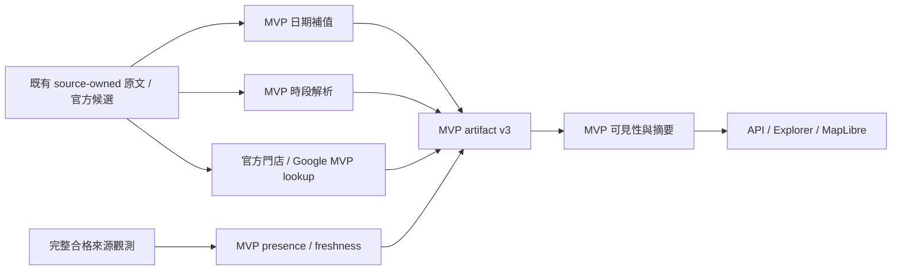

# Design — isolated MVP policy and source observations

狀態：2026-10-06 實作已交付。輸入：[spec.md](spec.md)。下述模組與單次指令已實作；啟用仍為 opt-in，原 v2 artifact 保留。

## 現有系統依據

- `src/ingestion/mvp/pipeline.ts` 以既有 parser／DateResolver 建立 source-owned MVP records；無日期或無結束日仍是 needs_validity。
- `src/domain/mvp.ts` 的 version-2 records／live visibility 需要完整日期。`src/server/mvp.ts` 讀靜態 artifact，MVP redeemableNow 固定 false，production 隱藏 Telegram 全文。
- `scripts/build-mvp-data.ts` 從 `exports/review-inbox-2026-09-16/review-inbox.json` 的唯一 136 原文建立 artifact；Google cache replay 与 live 失敗保留原 artifact 已有測試。
- `src/ingestion/direct-sources/runner.ts`、adapters 與 bounded fetch 可唯讀採集；DB ingestion／publication／worker 為另一條路徑。現有 acquisition_ready 要有 candidates，不能用它直接判定有效空列表。
- `src/ingestion/direct-sources/outlet-resolution.ts` 與既有 directory providers 可提供官方門店資訊；Google enrichment 不建立全店／參與證明。
- `src/components/Explorer.tsx` 共用 strict 與 MVP 呈現，故新顯示只能作用於 MVP metadata 分支。
- 研究 V4 已保存 point-to-range 錯誤與 opening_to 表示法；date-only profile 要求原文明示年份，不支援本計畫的日期推定。研究模組保持唯讀。

## 流程與隔離

產品 runtime 不新增 LLM。Code parser 直接使用原始優惠單位與連續引句；不繼承任何研究生成答案為事实。多組條件歸屬不能確定時保留未知與完整原文。

新邏輯集中在 `src/ingestion/mvp/`、MVP domain/server 與必要的展示分支。只讀既有 direct adapters；不得 import direct persistence/publication 或 server DB。Strict DateResolver、promotionSchema、publicationIssues、validity、worker、registry activation 與研究 monitor 不改。

`src/domain/promotion.ts` 如因共用 Listing type 需要變更，只可增加 MVP 選用 metadata；strict schema／判斷函式保留原內容與行為。以 scoped diff、既有回歸和依賴檢查證明，不把整個共用 type 文件聲稱完全未變。

## 資料契約

MVP artifact v3 增加以下資訊；v2 read-only compatibility 不偽造既有記錄的 firstSeen 或可靠發文日期。

- `validityType: dated | open_ended | null`；null 表示未解出，沿用 needs_validity。
- `anchorDate`、`anchorBasis: posted | first_seen | unavailable`、不可變 `firstSeenAt`、可信原始 `publishedAt`。
- `dateAudit`：原文日期片段及角色、stated／inferred、缺失單位、yearBasis／startBasis／endBasis、ruleVersion、補值步驟與 blockers。來源明示日期與推定日期分開。
- `scheduleRules[]`：星期與原文證據、time kind（range／opening_to／before／after／point／unknown）、nullable endpoints、PH／eve 排除、適用來源門店及 literal 條件。非單一組規則不壓成一組 hours。
- `hours.start` 在 MVP record 可為 null；到共用 Listing 的 legacy hours 只投影可表達的完整單一區間，其餘為 null。完整規則放 MVP metadata，不放寬 strict hours schema。
- `sourceObservation`：sourceId、source kind、能力、stable item key、lastSeenOnSource、lastSuccessfulCompleteCheckAt、最後嘗試狀態、presence（present／absent／unknown）、snapshotId／hash、TTL policy。
- `participationBasis: stated | default_all`、`directoryBasis: official | google | unresolved`，另保留排除和 selected 限制。既有 coordinateBasis／sourceLocation／Google address／locationAudit 保留。
- `sourceTextPolicy` 來自已驗證來源定義與來源種類，不靠任意 URL 或 model 自稱官方決定公開全文。

所有觀測 instant 保存 UTC，判斷日期使用 Asia/Singapore；now 作注入參數。政策版本固定 `mvp-offer-policy-v1`。

## 日期 normalizer

已新增 `src/ingestion/mvp/date-policy.ts`。先辨識角色及表達型別，再計算：完整日期、部分單日、from／till、整月、end of month。原文明示日期不可重寫。Calendar-month 是一個完整期間，採 spec S6；不能對月初與月底各自補成不同年份。

月底／跨年用 calendar construction 重新建立日期，驗證來源 day 未變；不使用自動 clamp／overflow 取得另一個 day。端點衝突只在有缺失單位且 spec 明允許時處理；其餘 abstain。

可靠 publication metadata 必須有 capture／解析依據，不能用 detail page updatedAt 或重查 observedAt 代替 posted。v2 artifact 缺 anchor 時仍可保留已有 dated 期間，不為新政策補發現時間。新 raw input 需有可稽核首次接收時間。

## Schedule parser 與假日

已新增 `src/ingestion/mvp/schedule.ts`。由 captured phrases 清點 grammar families；27 distinct forms 是待核對的清點輸入。先分 source-owned 條件組，再解析 weekday／clock／scope；留存字串 offsets 與引句。

point timeslot 不合成 range；last order／活動開始／營業時段不互相取代。來源內不同門店／不同 weekday 的價格及時段分組保留，未知關聯不 cross-product。每個 outlet 的摘要或狀態只使用能確定適用的規則。

已新增 `src/ingestion/mvp/holiday-calendar.ts`，接受 versioned calendar。實作時查核官方新加坡公眾假日來源並保存引用／擷取時間；合成日期 fixture 明確標示測試用途。PH eve 由相應假日前一天計算，LNY eve 由官方 Lunar New Year 第一日計算；不把二日假期前所有日子一概叫 LNY eve。Observed substitute holidays 與源文明示排除的節日種類需分開。

缺可靠 calendar coverage 時 scheduleState 為 Check source，不放寬 strict publication。Unknown opening time 不推成 00:00；可根據已知星期或結束時間顯示 Outside，但不能宣稱已開門。

## Source capability、快照與撤回

已新增 `src/ingestion/mvp/source-observations/`。Capability 分 current_offer_listing／historical_archive／permalink；只有第一種能續期或以缺席撤回。每個能力必須有來源語意及 captured fixture 證據；既有 official ownership／enabled flags 不能自行建立此能力。先評估 Pepper promotion listing；Shake blog 預設 archive，未證明目前列表語意前不續期。

重用既有 bounded acquisition 取得 listing proof／穩定候選身份，來源 snapshot 保存 visited pages、listing hashes、complete、truncated／errors、seen item IDs 與有效空列表證據。新增 MVP complete-snapshot validator，不改現有 direct acquisition_ready。有效空列表只有結構明確且 traversal 完整時成立；parser 失敗的空陣列不是空列表。

Stable source/item identity 用 sourceId + canonicalUrl + nativeId／明確 source-owned offer key；不能用每次會變的文字 hash 當身份。內容修訂與身份分開。Roundup 不確定 boundaries 不拿來判斷某優惠消失。

HTTP／parse failure、分頁 cap、unknown identity、未完成分類：記錄 failed／partial，但 lastSeen 與最後完整成功時間不改。僅成功 present 更新該 item lastSeen；只有完整 absent 更新 presence。Cache replay 不建立新 receipt instant。Out-of-order snapshot 不覆蓋較新狀態。

本輪新增單次 CLI `scripts/refresh-mvp-sources.ts`，以明確 source whitelist 執行；npm command `mvp:sources:refresh`。預設 fixture／offline；live 需要顯式 `--live --source <id>`。寫 `.local/mvp-source-observations/`，不寫 DB、研究服務 state 或 recurring startup。Single-writer lock、暫存檔 + atomic rename 保留上一份有效快照。

本輪為已審查來源提供 injectable bridge，把原始候選與 source-owned text 轉 MVP input，literal facts／可靠 metadata 與第一次接收時間完整保留。不加入未支援商家採集，未證明 source capability 的來源可保留 dated 記錄，不能啟用 open-ended。

## Lifecycle、門店與展示

已新增 `src/ingestion/mvp/lifecycle.ts`：dated 沿用日期期間；open-ended 看開始日期、qualified presence 與 TTL。未知觀測、stale、absence 分別保存，live 只接納符合政策的 active 記錄；corpus 保留全部。完整 reappearance 可恢復 open-ended，但不清除先前事件。

MVP outlet bridge 優先重用已支援 merchant official providers。Named/excluded 以原文身份匹配，Google search 不能改写 unit、street typo 或 named lookup failure。官方完整／部分名錄與 Google observed coverage 分別保存；fallback 允許地圖展示但保留未確認參與的文字提醒。

`src/server/mvp.ts` 映射新 metadata 與 source kind。`Explorer.tsx` 的 MVP 分支顯示 summary、last seen、standing line、來源；官方全文純文字公開，Telegram 原文的既有 production privacy 保留。No new assumptions badges/icons。

Live status 只描述 listed time window。不得復用 strict redeemableNow；MVP 狀態為 Within listed offer hours／Outside listed offer hours／Check source，避免從 default_all 推成參與證明。

## 相容、啟用與 rollback

已新增 `MVP_OFFER_POLICY=source_observed` opt-in，default legacy。v2 原 artifact 與凍結 conformance 留作舊模式，不直接覆寫。新政策先輸出 `.local/mvp-policy-preview/` 的 v3 artifact；通過來源逐筆 review 後，另存已審查 artifact 並更新新政策指定路徑。

`readMvpData()` 以 version-aware reader 與政策選擇載入；API request 不做 live fetching。讀取舊 artifact 不產生新 freshness。可在生成新 artifact 時合併已保存 observations；即使 artifact 未重建，serve 時仍依 now 重算 TTL 以隱藏 stale。

Build 不新增 middleware／public map provider，MapLibre 與現有 Google policy 不在本輪重設。新 artifact 失敗保留前版；回到 legacy policy 与原 artifact 即可 rollback。正式啟用與排程在本次 planning scope 外。

## 已知限制

首次發現日只能支持 MVP 推定，不證明歷史來源的真正活動年份。完整列表存在也只是來源目前報告，不是庫存／兌換保證。Google 非完整官方門店集合。來源若沒有 current-listing capability，持續抓 permalink 不會解決 open-ended 有效性。

Coverage 需新 parser 跑原文才知道；本計畫不預設百分比、不把研究成功重播當作線上可靠性證明。

## 實作共用契約 checkpoint

Parent 新增 `src/domain/mvp-policy.ts` 的 Zod contracts，worker 只讀。日期入口 `normalizeMvpDates({text,publishedAt?,firstSeenAt?})`；schedule 入口 `parseMvpSchedule(text)` 與 `evaluateMvpSchedule(rules, now, options)`；生命週期入口 `evaluateMvpLifecycle(input, now)`。Literal offsets 指向傳入的原始優惠文字。完整快照／storage contracts 由 D 的專屬 module export，bridge 由 parent 串接。限定型別的 sourceTextPolicy 只由已查核來源 bridge 產生。

Holiday calendar 使用 MOM 2026／2027 公告，擷取日 2026-10-06：

- https://www.mom.gov.sg/newsroom/press-releases/2025/0616-public-holidays-for-2026
- https://www.mom.gov.sg/newsroom/press-releases/2026/0618-public-holidays-for-2027

公告仍標示待確認的日期保留 provisional；不能用於確定 Within 狀態。Coverage N 沿用 14／7 天政策 horizon。

## Independent review 與交付 artifact

Independent reviewer 逐筆審查 104 個有 scalar 差異或 schedule additions 的 records，原 207-row automated ledger 不冒稱 human gold。Reviewer 輸出引用 exact preview／source ledger hashes；新 `artifact-review.ts` 要求完整且唯一的 review dispositions，SHA 不符或漏列拒絕生成。`npm run mvp:artifact:review` 產生另一份 `data/mvp-promotions-source-observed.json`，withheld／requires_correction 仍在 corpus，但 content/status 設 needs_content_resolution 並保存 reason；live gates 因而隱藏。Default legacy、production DB 與 strict rules 未改。

修復 review 發現：quota daily 不作七天優惠週期；問句 weekday 不作無截止日週期；未可靠歸屬的 all-month wording 保持未知；Tues-to-Thurs 含中間星期。MVP filter 在新 metadata 存在時改為 Within listed offer hours，依 active lifecycle + listed state 篩選，不復用 strict redeemableNow。

`official-directories.ts` 提供離線 captured provider factory（Pepper／Shake／Gourmet）；scope-specific Pepper type wording 先作用於 official enumeration，branch 地址／單位和 capture times 保留；缺少 per-branch accepted coordinate cache 就 needs_location，不開網路或改用合成座標。
