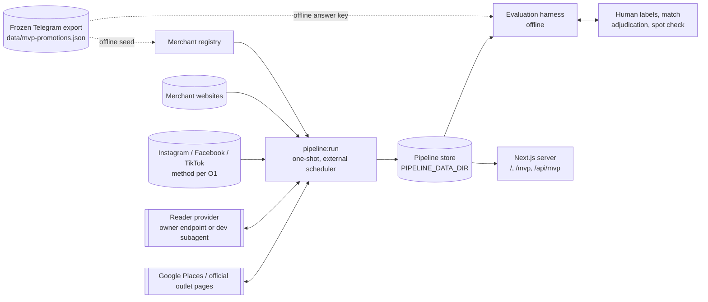

# PromotionAroundYou architecture

Status: **proposed replacement** for `docs/architecture.md`. It belongs to the official-source promotion map change ([intent](intent.md), [spec](spec.md), [design](design.md)). Nothing here is implemented. "(new)" marks code that does not exist yet. Every other path exists today and is reused. Paths are relative to the repository root.

It merges two independent reviews of the design: one simplicity-first, one robustness-first. Owner decisions are not reopened.

## 1. Purpose

The app shows Singapore food and drink promotions on a map. Every promotion comes from the merchant's own website, Instagram, Facebook or TikTok.

- **One pipeline, one served artifact.** An LLM reads each source and quotes it. Code checks the quotes and computes dates, schedules and outlets.
- **No pre-publication review.** No person approves offers. Rules decide what is shown, and a human spot check measures the error rate.
- **Accepted risk.** The user is told to check the source, so the system accepts recorded inference. It never invents coordinates, and it never shows free-form LLM text.

**Counted kinds:** deals, events and food festivals, and everyday low prices. Product launches, editorial pieces, channel ads, quizzes and news are not promotions.

## 2. System context



- **Two runtime processes.**
  - The job writes the store.
  - The web server reads only the current published generation. It never fetches sources, never calls the LLM or Google, and holds none of their keys.
- **Telegram is never fetched at runtime.** The frozen export (SHA-256 `e49d9e12…844b`) is only a seed and the answer key.
- **Deployment constraint:** with file storage, the job and the web server share a filesystem. Otherwise see O5.

## 3. Invariants

- **I1 One path.** Map data comes only from the published generation of this pipeline.
- **I2 The LLM proposes; code decides.** Source content and LLM output are untrusted.
  - A displayed fact is either a verbatim quote that code located in stored source text, or a value code computed from such quotes.
  - The LLM never supplies dates, times, URLs, coordinates, merchant identity or source acceptance.
- **I3 Failure never shrinks the map.** A failed or partial fetch, read or lookup cannot remove or shorten an offer. Offers only age out (§4.10).
- **I4 Facts are append-only; everything else is derived.**
  - Fetch records, content blobs, transcriptions and readings are immutable.
  - Offers and map generations are rebuilt from them with no network or LLM call, and without reading the clock.
- **I5 Identity is deterministic.** Offer IDs and cross-source merging are code rules. Rebuilding never resets a first-seen date.
- **I6 Every request is guarded.** All fetches go through the existing network guard. The LLM selects links by index and never emits a URL.
- **I7 Cost is bounded in code.** Every run has hard ceilings on LLM calls, tokens and images.
- **I8 Reader changes are measured.** A new provider, model or prompt serves only after the evaluation harness has run on a shadow generation (§9.6). This gates configuration, not individual offers.

## 4. Pipeline

| # | Stage | Module | Output | LLM | Network | On failure |
| - | ----- | ------ | ------ | --- | ------- | ---------- |
| 1 | Registry & discovery | `src/ingestion/official/registry/` (new) | `SourceRef` | proposes only | yes | candidate not accepted |
| 2 | Acquire | `src/ingestion/official/acquire/` (new) | `FetchRecord` + blobs | selects links by index | yes | outcome `partial`/`failed` |
| 3 | Transcribe images | `src/ingestion/official/read/transcribe.ts` (new) | `ImageTranscription` | vision | provider | image text absent |
| 4 | Read | `src/ingestion/official/read/` (new) | `Reading` | text only, no tools | provider | previous reading kept |
| 5 | Verify | `src/ingestion/official/verify/` (new) | `OfferFacts` | no | no | field dropped |
| 6 | Compute | `src/ingestion/official/compute/` (new) on `src/ingestion/mvp/*` | dates, validity, schedule | no | no | value unresolved |
| 7 | Outlets | `src/ingestion/mvp/outlets.ts` | outlet cache | no | Google / providers | previous cache kept |
| 8 | Identify & merge | `src/ingestion/official/offers/` (new) | `OfferCluster` | no | no | — |
| 9 | Build & publish | `src/ingestion/official/publish/` (new) | `MapGeneration`, pointer | no | no | previous generation kept |

Lifecycle (upcoming, active, stale, expired) is **not stored**. The server computes it per request, as `visibleMvp` (`src/domain/mvp.ts:158`) does today. A missed daily run therefore never keeps an expired offer active.

### 4.1 Registry and discovery

- **File:** `data/merchant-registry.json` (new, tracked). It replaces the closed `sourceIdSchema` enum (`src/ingestion/direct-sources/types.ts:4`) as the list of what to fetch.
  - The empty `data/merchant-source-registry.json` stays frozen for the research scripts that read it (`scripts/analyze-mvp-sources.ts:37`).
- **Seed (one-time, offline):** built from `docs/research/merchants.json`, `docs/research/social-source-inventory.json` and the website entries in `src/ingestion/direct-sources/registry.ts`.
  - Platforms are dropped: Grab/GrabFood, foodpanda, Kris+ (including `kris_plus_sg`), banks and publishers.
- **Shape:**

  ```ts
  type Merchant = { merchantId; name; aliases: string[]; outletProvider?: string; sources: SourceRef[] };
  type SourceRef = {
    sourceId; type: "website" | "instagram" | "facebook" | "tiktok";
    root: string;                    // account or listing root, never a single post or offer page
    allowedHosts: string[];          // from the accepted URL, never from page content
    trust: { anchor: "telegram_seed" | "operator_domain" | "places_domain" | "linked_from_accepted"; evidence: string[] };
    discoveredBy: "seed_telegram_link" | "web_search" | "manual";
    acceptedAt; status: "active" | "disabled";
    disabledReason?: "js_only" | "not_acquirable" | "owner_disabled";
  };
  ```

- **Discovery order:**
  1. Telegram seed links are resolved and reduced to their account or site root.
  2. Accepted websites are scanned for social links.
  3. Only merchants that still have no source go to LLM + web search. The LLM proposes; code fetches the evidence and decides.
- **Auto-accept rules (owner decision 13), hardened.**
  - A merchant's first source needs an anchor:
    - a resolved Telegram seed link;
    - an operator-name domain; or
    - a Google Places listing for a known outlet that points at the domain.
  - The anchor must also pass a **Singapore scope check**: a `.sg` domain, `+65` phones, Singapore addresses or SGD prices. This stops a global brand site from feeding foreign offers.
  - Further sources are accepted only when an accepted source links to them. A social bio linking to the site counts only if the site links back.
  - A verified badge supports acceptance but never suffices alone. Two unaccepted candidates never vouch for each other.
- **Roots only.** Registry entries never store an offer or post URL, so answer-key links cannot leak into evaluation (§9).
- **Suppress list** (tracked): `sourceId`, `merchantId` or `offerId` entries hidden at build time. It is an emergency control after the fact, not a review step.
- **Evidence:** rejected candidates and their reasons go to an append-only acceptance ledger.

### 4.2 Acquisition

- **Websites.** A small generic fetcher (new) on the existing network layer:
  - `validateTarget` (`src/ingestion/direct-sources/network-target.ts:43`) and the DNS-pinned `nodeBodyTransport` (`fetch.ts:46`);
  - redirect hops re-checked, per-run budgets using the `DEFAULT_LIMITS` values (`fetch.ts:17`);
  - content types: HTML, PDF and images.

  `BoundedDirectFetch` itself is not reused. Its grants are tied to the closed source and adapter enums, and it accepts only `text/html` and `application/pdf` (`fetch.ts:71`).
- **Listing pages.** Code extracts the same-host anchors (bounded count) and gives the reader a numbered list. The reader returns indices; code fetches exactly those. The LLM never emits a URL.
- **Social.** A `SocialAcquirer` (new, method per O1) provides `listPosts(source, window) → { outcome, window: {from, to, exhausted}, posts }`.
  - Each post carries its native ID, owner account, platform timestamp, caption and image URLs.
  - Posts whose owner is not the registered account are dropped.
  - No logins, no private APIs.
  - Video-only offers are not read (`video_only`).
- **Images.** Content types are restricted to JPEG, PNG and WebP (no SVG), with a magic-byte check.
  - Caps: 10 per item, 5 MB each, and a pixel-dimension cap.
  - Hosts are `allowedHosts` plus CDN hosts declared in code per acquirer.
  - Images are stored by SHA-256 and never served to browsers.
- **Outcome.**
  - `complete`: every planned page or post page succeeded, and for social the window was exhausted.
  - A fetch that finds zero items where the previous complete fetch found some is `partial:structure_changed`.
  - Partial fetches may add items; they never count as sightings of absence.
- **Item and revision.** An item is one post or one offer page or listing block.
  - Item key: `stableMvpItemKey` (`src/ingestion/mvp/source-observations/index.ts:145`).
  - Revision hash: SHA-256 of normalized text (NFKC, whitespace collapsed, volatile parts stripped) plus the sorted image hashes. Daily re-fetches of unchanged content therefore cause no re-read.
- **Backfill** uses the same command with `--since 2026-07-01`. The window starts before August because merchants post before Telegram reposts.
  - Records are flagged `backfill`.
  - Website backfill follows O3; archive captures get anchor basis `archive_capture`.
- **JS-only sites** are `disabled: js_only` unless O4 approves a headless renderer.

### 4.3 Image transcription

The vision model only **transcribes** each image to verbatim text.

- **Cache:** by `(imageSha256, transcriberTuple)`, so each image is transcribed once per configuration. Prompt changes re-run text-only reads without resending images.
- **Why transcribe first:** every image fact becomes a quote that code can locate (§4.5). Posters carry most dates and prices, and image text is also an injection channel.
- **Not displayed:** transcriptions are internal (O11).
- **Optional digit cross-check (O8):** a second transcription must agree on dates and prices, otherwise the fact is dropped as `image_unconfirmed`. Default is off; the spot check samples image-evidence offers as a separate stratum.

### 4.4 Read (LLM)

```ts
interface ReaderProvider {
  readonly metadata: { provider: string; model: string; promptVersion: string; schemaVersion: string }; // = reader tuple
  transcribe(image: { bytes: Buffer; mime: string }): Promise<unknown>;
  read(input: { text: string }): Promise<unknown>;
  selectLinks?(input: { text: string; links: string[] }): Promise<unknown>;
}
```

- **Input:** one item.
  - Its text plus each transcription under a fixed `[image N]` header, between nonce-delimited markers. The prompt declares this content untrusted.
  - No tools, no other item, no secrets.
  - **No dates are given:** not the posted date, not today. The reader cannot normalize dates.
- **Output** (strict zod schema, new; it does not reuse the frozen research schema): `offers[]`. Every string is a quote. Each offer has:
  - `kind`: `deal`, `event`, `everyday_price`, `not_promotion` or `uncertain`. `uncertain` keeps abstention, which is how the oracle ablation reached 36/36 precision. It is never mapped and counts as `read_uncertain`.
  - `brand`: only when one source covers several brands. It is mapped through registry aliases. Otherwise the merchant comes from the registry.
  - `title`, `benefit`.
  - `dates`: each `{ phrase, role: start | end | single | month | period }`.
  - `schedule`: quoted phrases.
  - `outlets`: `{ scope: named | all | unspecified, include[], exclude[] }`.
  - `onlineOnly`, `limitedTime`: quotes or null.
- **Providers:**
  - `HttpReader`: `READER_BASE_URL`, `READER_API_KEY`, `READER_MODEL`, `READER_PROTOCOL`. One protocol at first; a second is added only when the owner's endpoint needs it. Images go as base64 from stored bytes. Timeout and token settings follow `promotion-nlp/openai-provider.ts`.
  - Subagent reader (development, cheapest model): `read --export` writes pending tasks to `tasks/pending.jsonl` and exits. A Claude Code session answers them with subagents. `read --import` validates the answers into the same cache. Nothing polls. Scheduled runs refuse this provider.
- **Cache:** a reading is stored by `(revisionHash, readerTuple)`. If a new read fails, the last successful reading of that revision is used and flagged.

### 4.5 Verify (pure code)

- **Quote location.** Every quote must be found verbatim, after whitespace normalization, in the item text or the named transcription. Evidence is stored as `{ origin, start, end }`. A quote that is not found drops its field.
- **Required fields.** An offer without a located `benefit` is dropped. `not_promotion` and `uncertain` stop here, before any outlet lookup costs money.
- **Date phrases** need a month name, an ISO date, or a day number after a validity cue (from, till, until, valid, on, ends). A bare ordinal is rejected; this blocks "2nd Venti".
- **Schedule phrases** are parsed one by one.
  - An amount with a currency prefix is never a time (the "$200" error).
  - A single time never becomes a range (the invented "17:30–17:30").
- **Sibling offers.** When one item yields several offers, a date, schedule or outlet quote that sibling offers use with different roles is dropped from all of them. Code enforces "never borrow a neighbour's facts".

### 4.6 Compute (pure code)

- **Anchor:** the reliable posted date, otherwise first-seen (from the fetch ledger, §7), in Singapore time.
  - Reliable means a platform post timestamp, a dated listing item, `article:published_time` on the offer's own page, or an archive capture date.
  - A site-wide CMS date does not count.
- **Dates:** `normalizeMvpDates` (`src/ingestion/mvp/date-policy.ts:215`) is refactored into two parts:
  - fragment parsing per accepted phrase;
  - resolution: fill missing year or month from the anchor, roll end dates forward.

  The role is the reader's role when the phrase's lexical cue agrees; otherwise the date is unresolved.
- **Roll-forward cap (O7, default 120 days).** An end date that would roll more than 120 days past the anchor stays unresolved. Without the cap, a stale page reading "till 30 Sep", first seen on 7 Oct 2026, would become active until 30 Sep 2027.
- **Never rewritten.** Explicit values stay as written. An impossible date (31 Sep) stays unresolved. Contradictory or multiple end phrases stay unresolved (the existing `multiple_incompatible_periods` behaviour, `date-policy.ts:429`).
- **Start:** with no start date, start = min(anchor, end).
- **Validity type:**
  - `dated` when an end date is computed;
  - `open_ended` when the reader returned **no** end, single, month or period phrase;
  - `unresolved` when such a phrase exists but cannot be computed. Unresolved offers are hidden.
- **Schedule:** `parseMvpSchedule` and `evaluateMvpSchedule` (`schedule.ts:141,296`), plus `MOM_HOLIDAY_CALENDAR` and `holidayKindsOn` (`holiday-calendar.ts:99,108`).

### 4.7 Outlets

`resolveMvpOutlets` (`src/ingestion/mvp/outlets.ts:101`) receives a `ScopeResolution` built from the reader's outlet scope.

| Scope | Mapped |
| --- | --- |
| `named` | Only the named outlets. A name that cannot be found leaves the location unresolved; it never widens to all. |
| `all` / `unspecified` | The official directory, else Google (`GoogleOutletDiscovery.discoverMvp`). `directoryBasis` is recorded. |

- **Exclusions.** A matched exclusion is removed. An unmatched exclusion leaves the rest mapped and is recorded; the source text still shows it. This replaces the current "suppress all pins" early return.
- **Online only:** no pins. Pins always need real coordinates inside the Singapore bounds.
- **Official directories:** the five existing providers (Pepper Lunch, Shake Shack, Gourmet Carousel, Papi's Tacos, Genki Sushi), run with live transport. `capturedMvpDirectoryProviders` stays fixture-only.
- **Google cache:** `.local/mvp-google/`. With no cache entry and no key, there are no pins, never synthetic coordinates. Cache key: `(merchantId, scope, names, exclusions)`.

### 4.8 Identity and merging

- **`offerId`** = SHA-256 of `(merchantId, itemKey, economicSignature)`.
  - The economic signature is the normalized amounts, percentages and deal tokens ("1-for-1", "50% off 2nd") taken from the verified benefit quote.
  - Re-reads under a new model or prompt keep the ID when the signature is unchanged.
- **Clusters.** Offers of the same merchant with the same economic signature and compatible validity form one cluster, shown as one map entry.
  - Undated offers are compatible when their anchors are within the freshness window.
  - This covers website + Instagram + Facebook copies and re-posts.
  - **Representative:** explicit dates first, then website over social, then earliest anchor.
  - All source links are kept. First-seen is the earliest member's; sightings are unioned.

### 4.9 Freshness (computed at serve time)

One rule replaces observation states, capabilities and withdrawal.

| Source | What counts as a sighting |
| --- | --- |
| Website, current | Each `complete` fetch whose verified reading still contains the offer. |
| Website, archive | Only the first appearance. A source is classed `archive` while its listing shows any item whose explicit end date is more than 7 days past. |
| Social post | The post's own timestamp. Re-fetching an old post is not a new sighting. |
| Archive capture (O3) | The capture date. |

- **Open-ended offers** are active from start until `lastSighting + W`.
  - W = 14 days, or 7 when `limitedTime` is quoted (owner decision 8).
  - Social and archive sources may use a longer W (O6, default the same 14).
  - After W the offer is stale and hidden.
- **No withdrawal state.** An offer that disappears simply stops being sighted and ages out. A failed or partial fetch therefore can never hide an offer early.
- **Dated offers** are upcoming, active or expired by date. Expired offers stay in the archive and in evaluation.
- **Code changes:** `evaluateMvpLifecycle` (`src/ingestion/mvp/lifecycle.ts:6`) is rewritten for this rule. Today it returns `unknown` for open-ended offers unless an observation has capability `current_offer_listing` (`:30`), and both existing sources are `historical_archive`. `MVP_SOURCE_CAPABILITIES` and `applyMvpSourceSnapshot` are not reused.

### 4.10 Build and publish

**Build** is a pure function of:

- the registry;
- the fetch ledger;
- the transcriptions and the readings for the active tuples;
- the outlet cache;
- `computeVersion`;
- the suppress list.

Equal inputs give byte-identical output.

**Publish guards** must all pass:

1. schema validation;
2. no record without a source link or official text;
3. a record-count drop of more than 30% against the current generation blocks publishing unless the operator passes `--accept-drop`.

**Publish steps:** write `generations/<id>.json` (temp file, fsync, rename), then atomically replace `current.json` with `{ generationId, sha256 }`. Keep the last 30 generations.

**Rollback:** `pipeline:rollback <id>` repoints and creates `hold`, which stops later runs from publishing until `pipeline:release`.

## 5. Data contracts

```ts
type FetchRecord = { runId; sourceId; mode: "daily" | "backfill"; startedAt; finishedAt;
  outcome: "complete" | "partial" | "failed"; reason?: string;
  window?: { from; to; exhausted: boolean };
  items: { itemKey; nativeId?; canonicalUrl; revisionHash; postedAt?; postedAtBasis? }[];
  usage: { requests; bytes } };
type Quote = { text: string; origin: "text" | { image: number }; start: number; end: number };
type OfferFacts = { kind; benefit: Quote; title?: Quote; brand?: Quote;
  dates: { quote: Quote; role }[]; schedule: Quote[];
  outlets: { scope; include: Quote[]; exclude: Quote[] };
  onlineOnly?: Quote; limitedTime?: Quote; dropped: { field: string; reason: string }[] };
type PublicOffer = { id /* clusterId */; merchant; kind; summary; startDate; endDate;
  validityType: "dated" | "open_ended"; freshnessDays: number; firstSeenAt; lastSightingAt;
  scheduleRules; outlets; sourceText; sources: { label; url; type }[];
  audit /* quotes, bases, unmatched exclusions, tuples — never shown as badges */ };
type MapGeneration = { version; generationId; runId; generatedAt; readerTuple; transcriberTuple;
  computeVersion; registryHash; counts; records: PublicOffer[] };
```

`PublicOffer` extends the existing `mvpPromotionSchema` / `offerPolicySchema` (`src/domain/mvp.ts:30`, `src/domain/mvp-policy.ts:104`) as a new artifact version, so serving code is reused. `ttlDays` (typed `7 | 14` at `mvp-policy.ts:86`) becomes `freshnessDays`.

## 6. Trust boundaries

| Input | Trusted for | Not trusted for | Control |
| --- | --- | --- | --- |
| Frozen Telegram export | Seed hints, answer key | Runtime facts, public text | Offline only; never fetched or served |
| Discovery (LLM + search) | Proposing candidates | Ownership | Anchors, Singapore scope, linked-from rule, suppress list |
| Accepted source | The merchant's own statements | Completeness, current-ness | Freshness rule; archive detection |
| Fetched text and images | Data to quote | Instructions, URLs to follow | Delimiters; tool-less reader; links by index |
| Transcription | Candidate image text | Facts on its own | Quote location; optional digit cross-check |
| Reader output | Choosing and classifying quotes | Values, URLs, identity | Strict schema; quote location; code computation |
| Google Places / outlet providers | Outlet existence and coordinates | Promotion participation | Basis recorded; never fills a failed named lookup |
| Web server | Rendering the current generation | — | No pipeline keys; read-only |
| Credentials | — | Exposure | Job and server only; never `NEXT_PUBLIC_`; never in caches or artifacts |

**Output safety.**

- Source text renders as React text nodes, with no `dangerouslySetInnerHTML`.
- Only `http(s)` URLs inside the text become links, with `rel="nofollow ugc noopener noreferrer"`.
- Source links come from fetch metadata, must be HTTPS, and must point at the registered host or account.

## 7. Storage

```text
$PIPELINE_DATA_DIR (default .local/pipeline/, git-ignored)
  ledger/<sourceId>.jsonl          FetchRecords, append-only (source of first-seen dates)
  registry/acceptance.jsonl        discovery decisions, append-only
  blobs/sha256/<aa>/<hash>         text and image bytes, immutable
  transcriptions/<imageSha>.<tuple>.json
  readings/<revisionHash>.<tuple>.json
  outlets/<key>.json               TTL cache
  runs/<runId>.json                run manifest: outcomes, counts, usage, cost
  generations/<id>.json            immutable
  current.json                     pointer { generationId, sha256 }
  hold                             present = do not publish
  lock                             { pid, host, startedAt }; stale after a configured age
  tasks/                           subagent reader export/import (dev only)
data/ (tracked)
  merchant-registry.json, suppress list
docs/changes/official-source-promotion-map/evaluation/
  frozen answer key, ceiling trace, reports (pinned by hash)
```

- **Files are enough.** Immutable content-addressed files need no locking; the only mutable file is a small pointer that is replaced atomically. Back up `ledger/` and `registry/`; everything else can be rebuilt or re-fetched.
- **Atomic writes:** `atomicJson` (`src/ingestion/source-evidence/cache.ts:68`) plus fsync. `writeMvpSnapshotAtomic` is not reused, because it accepts only `MvpSourceSnapshot` and a crash leaves its lock behind.
- **Runtime output never goes under tracked `data/`.**
- **Server reads:** the server reads `current.json`, then the immutable generation, and caches it by ID. It re-checks the pointer at most once a minute. On Windows, pointer replacement retries on `EPERM`/`EBUSY`.
- **Retention:** blobs referenced by the last 30 generations or by the evaluation set are kept. Others are collected after 90 days. Ledgers are kept indefinitely.
- **Database:** the tables in `supabase/migrations/002_direct_sources.sql` are untouched.

## 8. Serving and UI

- **Data loading.** `readMvpData` (`src/server/mvp.ts:38`) becomes `readCurrentGeneration()`. These switches are removed: `MVP_OFFER_POLICY` (`:26`), `MVP_DATA_PATH`, `MVP_POLICY_DATA_PATH` and `PROMOTION_DATA_SOURCE` (`src/app/page.tsx:3`).
- **Routes.** `/`, `/mvp` (alias) and `/api/mvp/*` serve the current generation. `/corpus` stays development-only and shows hidden, stale and unresolved records with their reasons.
- **Computed per request:** lifecycle (§4.9) and the live status: Within listed offer hours, Outside listed offer hours, or Check source.
- **Detail view** (`src/components/mvp/OfferPolicyDetails.tsx`), in order:
  1. summary;
  2. schedule, optionally with "last seen on source DATE";
  3. live status;
  4. outlets;
  5. "Summary only. Check the source before you go." (`:72`);
  6. full official source text, always shown;
  7. source links.
- **Removed from the public view:** "First observed", date-fragment quotes, the `mayShowSourceText` restriction, and the `mvp-badges` block on list cards (`src/components/Explorer.tsx:457`). There are no badges anywhere.
- **Summary** = the verified benefit quote, cut at a word boundary, plus the computed date range. LLM free text is never displayed.

## 9. Evaluation harness

`scripts/eval/` (new) runs offline from stored blobs and readings. The same build produces the evaluated and the served offers. Scoring re-runs are byte-identical.

1. **Answer key.** The 200 pinned records come from 136 Telegram posts; 20 posts are split into several children (up to 10), and 40 records have no merchant.
   - Group children into campaign-level promotions, keeping their windows as attributes.
   - A person labels merchant and kind for every unit.
   - A model from a different family than the reader pre-labels them. The existing `offerStructure` labels in `tests/corpus/mvp-conformance-reviewed.json` (84 single, 55 roundup, 21 article/non-offer, 18 launch/ordinary menu, 2 unclear) are a starting point.
   - Non-promotions leave the denominator; an unidentifiable merchant is the miss `merchant_unidentified`.
   - The key is frozen with its hash.
2. **Holdout.** Before any tuning, split merchants by hash: 70% dev, 30% holdout. Iterate only on dev. Score the holdout once per release.
3. **Ceiling trace (first, before building acquisition at scale).**
   - For every answer-key unit, a person, with LLM search allowed, records where the merchant published it: website, Instagram, Facebook, TikTok, none, platform only, or removed.
   - This gives the reachable maximum per source type, and decides O1 and O3 with data.
   - Trace URLs are used only to attribute misses and never enter the registry.
4. **Coverage run, organic arm.** Acquisition only through registry roots (account or listing enumeration) with `--since 2026-07-01`, the same path as the daily job.
   - A **mapped** unit has: a counted kind; computed validity (expired is fine); at least one pin or a quoted online-only scope.
   - An optional **seeded arm** fetches the traced permalinks, to separate enumeration misses from reading misses. The headline number is the organic arm.
5. **Matching.**
   - Code first: same `merchantId`, compatible validity (undated: anchor within ±14 days of the Telegram post), equal economic signature.
   - The LLM proposes pairs whose signatures differ.
   - **A person confirms every claimed match and every `offer_not_found_on_source` miss.** At about 150–190 units this is a few hours.
   - Each miss gets the first reason that applies, in this order:
     1. `platform_only`
     2. `merchant_unidentified`
     3. `no_official_source`
     4. `social_not_acquired` / `js_only`
     5. `source_removed`
     6. `offer_not_found_on_source`
     7. `video_only`
     8. `read_failed` / `read_uncertain`
     9. `validity_unresolved`
     10. `outlet_unresolved`
     11. `deferred_budget`
6. **Spot check and reader gate.**
   - A seeded random sample of mapped clusters, stratified by:
     - source type;
     - text or image evidence;
     - inference basis: inferred year, Google all-outlets, unmatched exclusion, open-ended, newly accepted source.
   - Errors are counted separately for offer, kind, date and outlet.
   - The sample size comes from X (O2). Proving X with zero errors needs n ≥ about 3/X: 59 for 5%, 29 for 10%.
   - 50 per release, then 20 per week.
   - A new reader tuple or `computeVersion` serves only after a shadow generation from the same stored items shows no regression beyond the agreed tolerance.
7. **Reports:** coverage with a 95% Wilson interval, per source type and per miss reason, for dev and holdout. Written to `docs/changes/official-source-promotion-map/evaluation/`.

## 10. Scheduling, health and cost

| Command (new) | Effect |
| --- | --- |
| `npm run registry -- seed \| discover` | Build the registry; discover sources for merchants without one |
| `npm run pipeline -- run [--source id] [--since date] [--force]` | One-shot: acquire → transcribe → read → verify → compute → outlets → build → publish |
| `npm run pipeline -- read --export \| --import` | Subagent reader round trip (development) |
| `npm run pipeline -- reread --shadow` | Shadow generation for a new reader tuple; prints a call/cost estimate first |
| `npm run pipeline -- rollback <id> \| release \| status` | Operations |
| `npm run eval -- answer-key \| trace \| coverage \| spot-check` | Evaluation (§9) |

- **Running the job.**
  - `run` is idempotent per Singapore date: it exits if that run key has already completed, unless `--force` is passed.
  - It takes the lock, writes a run manifest and publishes unless `hold` exists.
  - An **external scheduler** (cron, systemd timer or Windows Task Scheduler) triggers it daily. It is enabled explicitly per environment.
  - `hourlyLoop` (`src/ingestion/hourly.ts:2`) is not used: it has no lock and starts a run on every restart.
- **Health.** `status` and the run manifest report:
  - generation age;
  - per-source outcome and consecutive failures;
  - quote-rejection rate per source and tuple;
  - usage and cost.
- **Alerts** (non-zero exit code plus a structured log line) fire when:
  - the generation is older than 30 hours;
  - more than 20% of sources failed;
  - a source has failed 3 runs in a row;
  - `structure_changed` occurs;
  - the quote-rejection rate is more than twice its 7-day median;
  - a budget ceiling is hit.
- **Cost.**
  - Steady-state cost scales with new or changed items only, because of the revision hash and the per-image and per-revision caches.
  - Ceilings per run and per source cover LLM calls, input tokens, images and estimated spend. Items over a ceiling are `deferred_budget`, which never counts as absence.
  - Images are downscaled to a maximum edge before sending.

## 11. Operational rules (replace the ingestion rules in AGENTS.md)

- **One path.** The map serves only the current published generation of the official-source pipeline. The strict DB feed, the Telegram MVP artifacts and `npm run worker` are retired from serving. Do not re-enable them without a change record.
- **Telegram is offline.** It is never fetched at runtime. `data/mvp-promotions.json` is the pinned seed and answer key, and Telegram text is never served.
- **The LLM proposes; code decides.**
  - Displayed facts are located verbatim quotes, or values computed from them.
  - Summaries are composed by code.
  - The reader has no tools, sees one item, and never supplies URLs, dates, coordinates or identity.
- **Computed only by code.** Dates, schedules and outlets come from `src/ingestion/official/compute` on top of `src/ingestion/mvp/{date-policy,schedule,outlets}.ts`. Explicit source values are never rewritten, and coordinates are never synthesized.
- **Guarded fetching.** All fetches go through `validateTarget` and the pinned transport. Social acquisition never logs in or uses private APIs.
- **Failure never removes an offer.** Offers only age out by the freshness rule.
- **Immutable state.**
  - Ledgers, blobs, transcriptions and readings are immutable or append-only.
  - Generations are immutable, and publishing is a pointer swap after guards.
  - Runtime output never goes in tracked `data/`.
- **Stable identity.** Offer IDs and merging are deterministic. Never regenerate first-seen dates.
- **Registry entries** store account or listing roots with an anchored trust signal. Never store an answer-key offer URL.
- **The daily job** is one-shot from an external scheduler: single instance, idempotent per Singapore date, enabled explicitly per environment. Scheduled runs never use the subagent reader.
- **Budgets** are enforced in code. Do not raise them to finish a run.
- **Evaluation integrity.**
  - A new reader tuple or compute version serves only after a shadow evaluation.
  - Never tune on the holdout.
  - Never regenerate the frozen answer key, the ceiling trace or `tests/corpus/mvp-conformance-reviewed.json` to pass tests.
  - Coverage matches are human-confirmed.
- **Tests** use captured fixtures and recorded readings. `npm test` makes no live LLM, social, website, Google or tile calls. Browser tests intercept public tiles (`tests/fixtures/tile.png`) and assert the app heading on `http://127.0.0.1:3100` before any mutation.
- **Unchanged:**
  - Demo data stays fictional and labelled.
  - Credentials stay in job and server modules.
  - Integration, load and restore checks use disposable local databases.
  - The Next.js version notice at the top of AGENTS.md stays.

## 12. Retired, reused, preserved

| Status | Code |
| --- | --- |
| Retired from serving (code kept) | Strict DB feed (`src/app/api/promotions`, `src/server/promotions.ts`). Direct-source runner, publication, persistence and review (`src/ingestion/direct-sources/{runner,publication,persistence,publish-store,review}.ts`). Hand-written offer adapters (`direct-sources/adapters/*` except the `*-outlets.ts` providers). Telegram ingestion (`src/ingestion/{runner,live,service,worker}.ts`). Telegram MVP parser path (`src/ingestion/mvp/pipeline.ts`, `src/ingestion/resolution/parser.ts`). `/admin` and `/api/admin/*`. `data/mvp-promotions-source-observed.json`. |
| Reused | Network guard and `nodeBodyTransport`. `src/ingestion/mvp/` date arithmetic (refactored), schedule, holidays and outlets. The five outlet providers. `GoogleOutletDiscovery.discoverMvp` and its cache. `stableMvpItemKey`. `atomicJson`. `mvpPromotionSchema` / `offerPolicySchema` (new version). Serving in `src/server/mvp.ts` and `visibleMvp`. `OfferPolicyDetails` and `Explorer`. |
| Not reused | `BoundedDirectFetch`. `MVP_SOURCE_CAPABILITIES`, `applyMvpSourceSnapshot` and completeness proofs. `capturedMvpDirectoryProviders` at runtime. `hourlyLoop`. `writeMvpSnapshotAtomic`. `src/ingestion/promotion-nlp/` schemas. |
| Preserved untouched | Migrations, research documents and seals, frozen corpora, `.local/source-discovery-service/`, `data/merchant-source-registry.json`. |

Captured fixtures for the hand-written adapters, under `tests/fixtures/direct-sources/`, become reader regression fixtures.

## 13. Open decisions

| ID | Decision | Default until decided |
| --- | --- | --- |
| O1 | Social acquisition method. Spike Instagram first: offer-associated social links were Instagram 26, Facebook 2, TikTok 1 ([audit](../direct-source-candidate-audit/verification.md)). | Social sources registered but not fetched (`social_not_acquired`) |
| O2 | Spot-check target X, and whether it applies to the point estimate or the upper bound | — |
| O3 | Website backfill from web-archive snapshots | Misses count as `source_removed` |
| O4 | Headless rendering for JS-only sites | `js_only` |
| O5 | Store location when the job and the web server don't share a filesystem (object storage or DB behind the same interface) | Same host |
| O6 | Freshness window W for social and archive sources | 14 days (same as website) |
| O7 | Roll-forward cap | 120 days |
| O8 | Second-transcription digit check for image dates and prices | Off; image evidence sampled as its own stratum |
| O9 | Thresholds: publish-drop guard, budgets, alert levels | Values in §4.10 and §10 |
| O10 | Google fallback website-domain check (may change Places billing tier) | Off |
| O11 | Whether image transcriptions are ever shown publicly | No |

## 14. Where things are

| Topic | Location |
| --- | --- |
| This architecture | `docs/architecture.md` (after approval) |
| Change record | `docs/changes/official-source-promotion-map/` |
| New pipeline | `src/ingestion/official/` (new) |
| Network guard and transport | `src/ingestion/direct-sources/network-target.ts`, `fetch.ts`, `source-scope.ts` |
| Dates, schedule, holidays, outlets | `src/ingestion/mvp/`, `src/domain/mvp-policy.ts` |
| Serving | `src/server/mvp.ts`, `src/app/page.tsx`, `src/app/mvp/page.tsx`, `src/app/api/mvp/` |
| Evaluation | `scripts/eval/` (new), `docs/changes/official-source-promotion-map/evaluation/` |
| History | `docs/changes/**`, including the direct-source and NLP records, which are no longer current |
