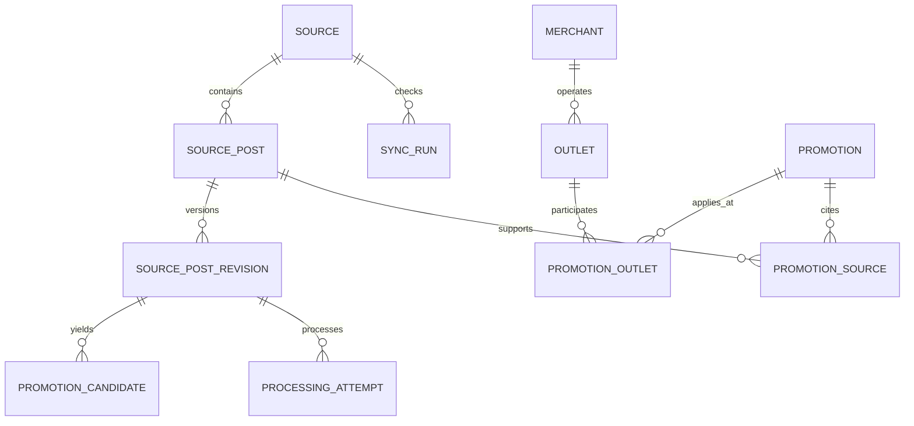
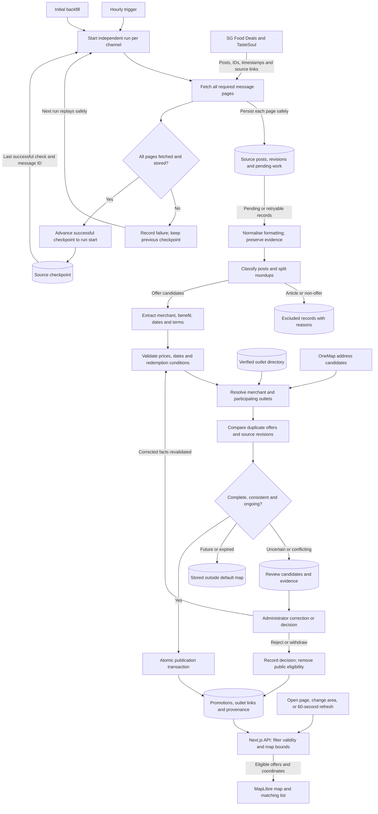
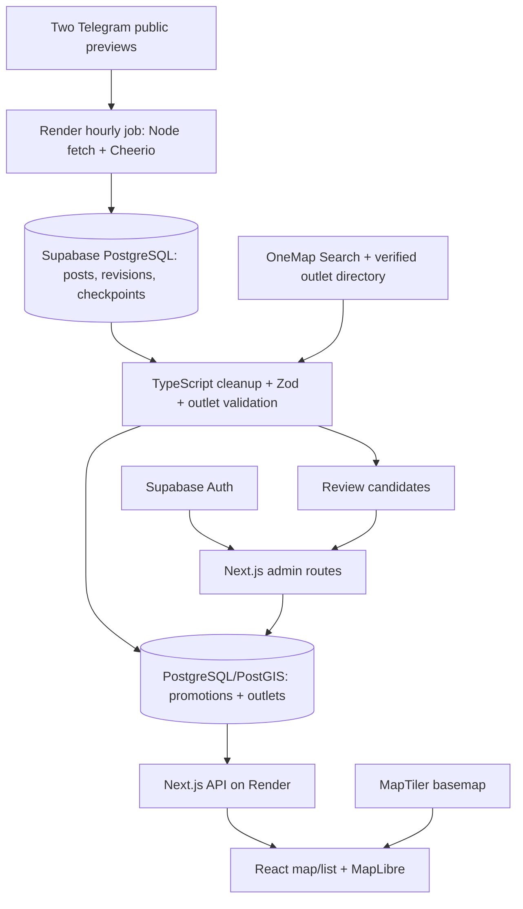

# System design: Singapore promotion map

Status: Implementation baseline; application build authorised, deployment excluded. Requirements originate in [spec.md](spec.md); execution and verification are tracked in [plan.md](plan.md).

## Reading guide
1. [Requirements](#1-requirements): functional scope and measurable quality targets.
2. [Core entities](#2-core-entities): information and relationships.
3. [APIs and interfaces](#3-apis-and-interfaces): contracts between parts.
4. [Data flow](#4-data-flow): how messages become map listings.
5. [High-level system design](#5-high-level-system-design): components, technologies, boundaries and deployment.
6. [Deep dives](#6-deep-dives): cleanup, consistency, recovery and source-access details.

## 1. Requirements

### Functional requirements
The authoritative acceptance criteria are in [spec.md](spec.md). This design implements:

| Requirement | Acceptance criteria | Responsible parts |
|---|---|---|
| Find ongoing Singapore promotions on a matching map/list | AC1–AC4, AC10–AC11 | Web client, public API, PostGIS |
| Collect both selected channels hourly using saved progress | AC8–AC9 | Scheduler, collector, checkpoint records |
| Clean posts, resolve outlets and avoid duplicate offers | AC2–AC6 | Cleanup modules, outlet directory, source revisions |
| Publish complete offers and review uncertainty | AC6–AC7 | Validation, publication transaction, admin UI |
| Preserve sources and freshness | AC8 | Provenance records, sync status, public details |

### Non-functional requirements
These are proposed engineering targets, not measured results or user-approved service guarantees. The hourly collection interval is already agreed.

| ID | Proposed target | Design response | Verification |
|---|---|---|---|
| NFR1 Performance | Public offer API p95 below 500 ms at 10 requests/second on pilot data; usable mobile map within 3 seconds on a defined mobile test profile | Geographic index, bounded pagination, client-only map, separate collector process | Load test and mobile browser trace; record device/network profile |
| NFR2 Freshness | Hourly checks; healthy runs finish within 10 minutes; published changes reach an open map within 60 seconds | Independent runs, timing metrics, one-minute client refresh | Timed end-to-end import and refresh test; source delays/review excluded and reported |
| NFR3 Integrity | No duplicate posts on replay; no checkpoint advance past unstored work; no partially published offer | Unique constraints, durable work, transactions | Fault injection around page writes, checkpoint updates and publication |
| NFR4 Availability and recovery | Collector outage does not prevent serving existing valid data; proposed public availability objective 99.5% monthly; proposed database recovery point 24 hours and recovery time 4 hours | Separate web/job runtimes, read-time expiry, selected backup plan and restore procedure | Dependency outage tests and restore drill; hosting/backup plan must support targets before commitment |
| NFR5 Security/privacy | No anonymous access to raw/review data or privileged credentials; no persistent visitor-location storage required | Server-side role checks, private schemas, least-privilege database roles | Authorisation integration tests, secret/config review |
| NFR6 Operability | Every source run has an outcome, counts and duration; failed or stale sources visible to administrators | Structured logs and sync_runs; stale when last success exceeds two hours | Simulate source failure and inspect admin status; no notification automation is created |
| NFR7 Maintainability/cost | Two source adapters share one cleanup contract; spend stays within a ceiling still to be agreed | TypeScript modular monolith, managed PostgreSQL, no separate queue or AI service initially | Parser replay tests; provider estimate and quota review before deployment |

### Capacity assumptions
Size the first implementation for two channels, up to 1,000 collected messages/day combined, 10,000 ongoing offers and 20,000 outlets. These are test envelopes, not observed traffic. At 1,000 messages/day and an assumed 10 KB of text/metadata per message, raw logical intake is about 10 MB/day or 300 MB/30 days before revisions, indexes and backups. Images are not mirrored in the baseline. Retention and production sizing remain to be decided from observed volume and permitted storage.


## 2. Core entities

- Source: internal ID, username, verified external ID when available, access method, enabled state, sync status, last attempted check, last successful check timestamp, and last processed message ID.
- SourcePost: source ID, message ID, permalink, publication/edit timestamps, content reference permitted by the source arrangement, import status. Unique source ID/message ID pair.
- Merchant: name and aliases.
- Outlet: merchant ID, branch name, address, unit, coordinates, verification evidence/time.
- Promotion: description, redemption terms, start/end dates, date certainty, schedule, exclusions, status, review due date, verification time.
- PromotionOutlet: confirmed participation and supporting evidence.
- PromotionSource: multiple post references per offer; supports splitting one roundup into several offers.
- Review history: actor, action, timestamp, and changed facts.

Additional durable entities: SourcePostRevision, ProcessingAttempt, PromotionCandidate and SyncRun support cleanup replay, pending work and operational evidence. Their roles are detailed in section 6.



A source post may produce multiple offers, and one offer may cite multiple source posts. Outlet coordinates do not themselves establish participation. Source checkpoints belong to the source, not to an individual promotion.


## 3. APIs and interfaces

Raw posts, processing attempts, review records, and source credentials stay in private schemas with no anonymous API grants. Use separate database roles for public server reads, administrative writes, and ingestion; browser code never receives a database connection string or privileged Supabase key. Verify Supabase sessions server-side on every administrator mutation and enforce the administrator allowlist. Protect cookie-authenticated mutations against cross-origin requests.

Use a transaction-capable database connection and transaction-scoped advisory lock per source. Add unique `(source_id, message_id)` constraints, revision hashes, and a GiST index on outlet geography points (SRID 4326). Use parameterised SQL and geographic bounds filtering before joining eligible offers.

Proposed API contracts:
- `GET /api/promotions?bbox=west,south,east,north&category=...&cursor=...`: validated bounds, ongoing published offers and outlet coordinates, at most 200 records per page, next cursor and source freshness timestamps. The client loads subsequent pages; never silently truncate map results.
- `GET /api/promotions/:id`: conditions, schedules, participation, provenance, verification time; unpublished records are inaccessible publicly.
- `GET /api/places?q=...`: bounded server-side OneMap lookup with cached results where permitted, no public exposure of its token.
- `GET /api/admin/review` and `POST /api/admin/promotions/:id/review`: authorised review list and approve/correct/withdraw action, expected revision for conflict detection, audit record.
- `GET /api/admin/sources`: per-source attempt/success times, failures and pending counts.

Refresh map data every 60 seconds and on focus, cancel obsolete requests when bounds change, and use an uncached validity check so expiry does not depend on a successful collector run. The map component runs client-side; collection and secrets stay server-side.

### Interface behaviour
Return JSON with stable IDs, ISO timestamps, explicit nullable unknowns and validation issues where appropriate. Use 400 for invalid queries, 401 for missing authentication, 403 for non-administrators, 404 for unavailable records, 409 for stale review revisions, 429 for throttling and 503 for temporary dependency failure. Public errors never expose raw messages or secrets.

The map response groups offer summaries by outlet with source freshness and pagination metadata. Detail records include date certainty, schedule and redemption restrictions. Administrator corrections submit the expected candidate revision and a reason. The source adapter accepts source identity, checkpoint and run-start upper bound, and yields message pages plus a completion result; incomplete fetches cannot signal success. Exact Zod schemas are implementation work.

- Public offer query accepts map bounds, category, and validity filter; returns paginated published offers with matching outlets and provenance.
- Offer detail returns conditions, schedule, participating outlets, and source links.
- Administrator operations approve, revise, or withdraw an offer after server-side authorisation.
- Import adapter emits normalised source-post records; parsing alone does not publish an offer; the validation stage may publish eligible ongoing offers automatically.

Endpoint boundaries, initial pagination limits, and technology choices are defined above; exact request/response schemas will be encoded in Zod during implementation.

## 4. Data flow

This diagram follows the data rather than the hosting components. Each source has its own checkpoint. Initial backfill scans a declared history window for ongoing offers; subsequent runs collect incrementally.



### Failure and consistency rules
- Page writes are deduplicated by source/message ID. A later page failure leaves the old checkpoint intact, making a replay safe.
- The checkpoint tracks successful collection, not successful publication. Every collected record has durable pending processing work before checkpoint advancement.
- Cleanup failures keep retryable records; incomplete facts stay in review. Neither outcome creates a map pin.
- Changes to published facts suspend the affected offer for review; the diagram’s revision comparison must apply this existing rule before considering publication.
- Map reads check current validity independently of the hourly collector. Expired offers are excluded even during an ingestion outage.
- Future records require re-evaluation when their date range begins. Their transition to publication uses the same validation gates, rather than relying on a new source message.

## 5. High-level system design

### Architecture and boundaries
Use a modular monolith with two deployed processes: the web/API process handles browsing and administration, and the scheduled collector handles source I/O and cleanup. Both use the same versioned domain rules and database. This keeps ingestion failures and slow external requests off the visitor request path while avoiding distributed-service overhead for two channels.

There are four boundaries: untrusted Telegram/external content; trusted server processing; private managed persistence/authentication; and the public browser. The browser receives published facts through the API and basemap tiles from MapTiler. OneMap is used on the server for address candidates; it is not a dependency for reading already-published promotions.

### Architecture diagram



The cleanup stage runs inside the collector process and can replay pending database records on subsequent runs. Database work records provide retry durability; a separate queue service is unnecessary at the initial two-source scale. The collector exits nonzero on failed source runs after recording independent outcomes. Initial history import uses the same command with an explicit bounded backfill option.

### Framework and tool choices

Status: original selected baseline; installed implementation and deviations are listed below. Nothing is deployed. These are engineering choices proposed to meet the agreed behaviour; paid service plans and source collection feasibility still require validation. Pin supported package versions in the lockfile at implementation time.

| Layer | Choice | Responsibility and reason |
|---|---|---|
| Language/runtime | TypeScript, Node.js 24 LTS, npm | Shared types and validation between collector and web server; one runtime for this small system |
| Web framework | Next.js App Router with React | Mobile map/list, promotion details, administration, and server API in one application |
| Styling | Tailwind CSS | Responsive layouts and shared design tokens |
| Map renderer | MapLibre GL JS | Client-side map, outlet markers, clustering, and viewport events |
| Basemap | MapTiler Cloud | Hosted map styles/tiles; retain required attribution and restrict browser key to app origins |
| Singapore address lookup | OneMap Search API | Resolve addresses/postal codes into candidate coordinates; server-side token; verified outlet directory still determines participation |
| Database | Supabase-managed PostgreSQL with PostGIS | Durable posts/checkpoints, relational offer data, transactions, geographic indexes and bounds/distance queries |
| Database access | node-postgres (`pg`) and versioned SQL migrations | Explicit transactional imports and PostGIS SQL; server-only database access |
| Administrator identity | Supabase Auth | Invite-only administrator sign-in; server validates identity and a database-held administrator allowlist |
| Collector | Node fetch + Cheerio | Fetch and parse public preview HTML through a source adapter, subject to feasibility/reuse validation below |
| Cleanup | Source-specific TypeScript rules + Zod schemas | Preserve conditions, extract fields, reject malformed candidates; no LLM or OCR dependency for launch |
| Schedule/hosting | Render web service + Render hourly Cron Job | Same repository runs a long-lived Next.js server and a separate bounded collector process |
| Date calculations | Luxon | Explicit Singapore timezone, relative-date and schedule evaluation |
| Checks | Vitest, Playwright, TypeScript, ESLint | Parser/business-rule tests, real PostgreSQL integration checks, browser journeys, static checks |
| Operations | Structured JSON logs + sync_runs table + Render run status | Diagnose imports and show last successful sync in administration without another monitoring service initially |

### Component responsibility and failure isolation
| Component | Owns | Failure behaviour |
|---|---|---|
| Render scheduler and collector | Hourly source runs, durable collection and cleanup | Retry from source checkpoint; web reads continue |
| Next.js public API | Published geographic queries and validity checks | Return controlled errors on database outage; do not invent fresh results |
| Next.js admin | Review decisions, source health and audit | Auth failure blocks changes; public browsing remains independent |
| Supabase PostgreSQL/PostGIS | Authoritative source, processing and publication state | Database outage stops writes and fresh reads; restore procedure governs recovery |
| Supabase Auth | Administrator identity | No administrator mutation without verified session |
| OneMap and verified directory | Address candidates and branch evidence | Unresolved new locations wait; existing verified offers remain readable |
| MapTiler and MapLibre | Basemap and client rendering | Show the promotion list and a map-unavailable state if tiles fail |

### Scaling and tradeoffs
Start with one web instance, one scheduled collector execution and managed PostgreSQL. Measure before changing the topology. If runtime exceeds the hourly window, split sources into independently scheduled jobs while preserving per-source locks. If cleanup backlog grows, add a separate worker consuming the existing durable pending records. If map payloads or API latency miss NFR1, introduce server-side spatial aggregation and measured query tuning before adding caches. Any cache must respect publication changes and expiry boundaries.

Public-preview parsing avoids channel-bot setup but trades away a stable documented feed contract. Managed services reduce operational setup but create provider cost and dependency concerns. Rule-based cleanup is auditable but routes more unusual/image-dependent posts to review. These tradeoffs are explicit; collection feasibility is still a gate.

### Deployment and operations
Render runs the web service and an hourly scheduled ingestion command from the same code revision. Supabase holds persistent state so web/job restarts do not reset checkpoints. Store database URLs, OneMap credentials, and server auth configuration in service secrets; the browser only receives intended public configuration such as its restricted tile key.

Before deployment, choose compatible nearby service regions, verify current pricing/quotas, backup/restore availability, and set a user-approved spend ceiling. No free-tier or exact monthly cost is assumed. Deploy migrations first, run a bounded initial import with publication inspected, then enable hourly scheduling and the web service. Keep the schedule disabled until local ingestion and recovery checks pass. Roll back application revisions separately from schema changes; use forward-compatible additive migrations initially.

### Repository layout and planned commands

```text
src/app/                    # pages, administration, API route handlers
src/components/map/         # MapLibre, markers, map/list coordination
src/server/db/              # pg pools, parameterised queries
src/server/auth/            # session and administrator checks
src/ingestion/sources/      # Telegram preview adapter
src/ingestion/cleanup/      # classification, parsing, validation, deduplication
src/ingestion/runner.ts     # hourly and backfill entry point
src/domain/                 # shared Zod schemas, validity rules
supabase/migrations/        # SQL schema, permissions, indexes
tests/                     # fixtures, integration, browser tests
render.yaml                 # future web/cron deployment definitions
```

Planned npm scripts: `dev`, `build`, `start`, `typecheck`, `lint`, `test`, `test:integration`, `test:e2e`, `db:migrate`, and `ingest`. They do not exist yet and must be verified after scaffolding. Use local PostgreSQL/PostGIS for integration tests; never run destructive test setup against a hosted production database.

## 6. Deep dives

### Incoming-data cleanup pipeline (AC2–AC8, AC10–AC11)

Cleanup runs after durable collection and before map publication. Keep source evidence separate from cleaned fields so a parser change can be replayed without re-fetching or losing the original meaning. Store source content only to the extent permitted by the selected source arrangement.

#### 1. Preserve and normalise the input
- Record source/message ID, permalink, original publication time, edit time, collection time, content hash, and parser version.
- Preserve original text or an allowed evidence reference; produce a separate working copy with normalised whitespace, line endings, and Unicode for matching.
- Remove Telegram presentation metadata such as views and reactions from the working copy. Treat emoji date/location markers as field cues before removing decorative characters.
- Preserve currency symbols, percentages, promo codes, unit numbers, URLs, negation, and conditions such as “selected”, “excluding”, “up to”, and “from”. Render text safely rather than executing source HTML.
- Group related media/captions only when source metadata proves they belong together. Image-only terms remain incomplete and go to review in the baseline design; OCR/LLM processing is not assumed available or permitted.

#### 2. Classify and split
Source-specific rules identify offer posts, roundups, articles, announcements, and online-only offers. A clear promotional benefit is required for a promotion candidate. Uncertain classifications go to review rather than being discarded.

Split roundups into independently traceable candidates, each retaining its source section. Do not apply one merchant’s dates or conditions to the other entries. Non-offers retain a processing outcome/reason without becoming public promotions.

#### 3. Extract structured facts
Each candidate contains merchant text, offer title, benefit type, price/discount where explicit, currency, promo code, redemption method, minimum spend, audience restrictions, date text, schedule text, location text, and source links. Missing values are null, not inferred defaults.

For each extracted field retain the evidence excerpt/reference and how it was obtained: source rule, verified directory, or administrator correction. Use explicit validation results rather than an unexplained confidence score to permit publication.

#### 4. Normalise commercial terms and validity
- Parse SGD amounts as decimal values; preserve “from”, “up to”, “++”, and per-person qualifiers. Do not turn “up to 50%” into a guaranteed 50% discount or “1-for-1” into an unconditional half-price offer.
- Resolve “today” and “now” from original publication time in Singapore, never import time. Record inferred start bounds as such, rather than claiming an exact launch date.
- Parse end dates, individual dates, weekday restrictions, time windows, and holiday exclusions separately. Use an exclusive upper bound at the following local midnight for date-only inclusive end dates.
- Resolve missing years only when source context is unambiguous; year rollover, conflicting weekday/date combinations, impossible dates, and end-before-start combinations require review.
- Unknown expiry is not proof of an ongoing offer. Keep it off the default map until validity is verified. Future and expired records can remain stored but are excluded from ongoing results.
- Promotion hours are distinct from merchant opening hours. Missing redemption hours must not be represented as confirmed 24-hour availability.

#### 5. Resolve merchants and participating outlets
Match merchants through a maintained alias directory, preserving the source spelling. Resolve explicit branch names, mall names, addresses, postal codes, and units against the verified Singapore outlet directory. Fuzzy matches are suggestions for review, not sufficient evidence to publish.

Geocoding locates an address; it does not prove an outlet participates. “All outlets” expands only against a verified applicable branch list; “selected outlets” needs participation evidence. Ambiguous branches and locations outside Singapore are held or excluded with a reason. Preserve unit numbers in display data even if coordinates identify the building.

#### 6. Deduplicate without losing evidence
- Message deduplication uses source ID + message ID. Changed content hashes create a new source revision and trigger reprocessing, not a duplicate promotion.
- Give split candidates stable internal IDs. Reprocessing must reconcile additions/removals against the previous revision; do not depend solely on list position as an enduring identity.
- Offer matching compares canonical merchant, benefit, validity, participation, promo code, and material conditions. A content fingerprint selects candidates for comparison; it is not proof of equality.
- Merge only equivalent verified offers, retaining all source references. Different branches, restrictions, or conflicting dates must not silently broaden an offer; route unresolved comparisons to review.

#### 7. Validate and publish atomically
Processing states: pending → normalised → extracted → validated, with terminal/routing outcomes published, needs_review, excluded, or retryable_error. Store reasons such as missing_expiry, ambiguous_outlet, conflicting_terms, unsupported_media, or not_a_promotion.

Auto-publication requires a genuine offer, usable source reference, verified current validity, preserved material conditions, and confirmed Singapore outlet participation/coordinates. Passing extraction alone is insufficient. In a transaction, write the cleaned promotion, participation links, provenance, and publication state so the map cannot see half-written records.

Edits affecting published facts suspend the affected listing for review, consistent with AC6. Preserve the previous version for audit, but do not keep serving known-conflicting facts. Administrator corrections retain their author and evidence; later imports cannot silently overwrite them. A failed enrichment step leaves a durable retry/review record and does not lose the collected message.

#### Cleanup records and diagnostics
Add SourcePostRevision (content hash, evidence/reference, timestamps), ProcessingAttempt (revision, parser version, outcome, error/retry details), and PromotionCandidate (structured fields, per-field evidence, validation issues, links to published promotion). Record counts per run for collected, unchanged, extracted, published, excluded, pending review, and failed items. A parser-version change can reprocess stored evidence with the same validation gates.

#### Illustrative acceptance fixtures
These examples are synthetic and are not live promotions.

| Input or situation | Required cleaned outcome |
|---|---|
| “1-for-1 mains, 15–30 Sep 2026, weekdays 2–5pm, Example Cafe at Mall A #01-02” | Separate benefit, date range, weekday/time constraints, and unit; publish only after matching verified participation |
| “Up to 50% off, selected outlets” | Preserve the upper-limit qualifier; missing validity/participating outlets routes to review |
| “Today only” posted yesterday but collected today | Expired, never a current map offer |
| Same message delivered twice | One source post and no duplicate promotion |
| Two channels describe the same offer with different end dates | Review conflict; do not choose the later date automatically |
| “Use code in image above” without readable terms | Unsupported-media review; no guessed code or publication |

### Hourly collection and recovery (AC9–AC11)

- Run each source every hour with a per-source lock to prevent overlapping runs. This is an application worker design, not a Codex reminder.
- Record run start time and fetch all pages needed to cover messages since the previous successful checkpoint. Use a small overlapping time window and stable source/message IDs to handle equal timestamps and retries. Timestamp-only filtering is insufficient.
- Upsert source posts under a unique source/message ID constraint. Persist messages and pending processing work durably before advancing the checkpoint to the completed run’s start time. Keep attempt time separate from success time.
- If fetching a page or persisting data fails, do not advance that source’s checkpoint. Safely replay already stored messages next time. One source’s failure does not block the other.
- Extraction failures remain durable pending/error records for retry or review; they must not disappear when collection progresses. Publication requires validated dates, conditions, and participating outlets.
- First run: scan a declared historical window for ongoing offers, then continue incrementally. History depth is unresolved; do not imply that a limited scan finds every ongoing offer.
- Re-fetch source posts backing active offers where the chosen adapter supports it, so older edits are not missed by a new-message timestamp filter. Mark unsupported edit/deletion coverage explicitly; do not claim complete detection.
- Public reads filter expired, future, withdrawn, and unverified offers. Proposed frontend default: refresh every minute and on returning to the page; show published changes without redeploying the frontend.
- Store checkpoint timestamps in UTC; evaluate promotion dates and schedules in Asia/Singapore.

### Location and time handling

Maintain a verified Singapore outlet directory. A merchant name alone cannot select a branch. Geocoding candidates require address and branch confirmation; unit numbers remain visible even when coordinates point to the building.

Use Asia/Singapore for offer validity. Keep promotion redemption hours separate from store opening hours. Preserve uncertainty in missing years and relative dates. Unknown expiry requires a review policy agreed in the specification (AC4).

### Ingestion decision and constraints

The [Telegram Bot FAQ](https://core.telegram.org/bots/faq) documents channel messages for channels where a bot is a member. Channel-owner cooperation may enable this bot route; subscriber access alone does not establish bot access. Administrator access is not required for viewing the public previews and is only relevant if this integration route is chosen. A bot integration must not assume historical backfill or complete deletion notifications.

Review [Telegram API terms](https://core.telegram.org/api/terms) and [content licensing terms](https://telegram.org/tos/content-licensing) when establishing collection and reuse. Do not presume public previews authorise automated aggregation or AI processing. Select an appropriate source arrangement before automation; manual curation or publisher-provided data can support an initial pilot subject to the same reuse assessment.

### Failures, security, and tradeoffs

- Retry transient imports with bounded backoff; preserve last successful sync separately from last attempt.
- Repeated imports update the same post identity. Conflicting cross-source claims go to review rather than automatic merging.
- Render imported text as untrusted content; do not execute embedded markup or instructions.
- Protect administration on the server; keep any ingestion credentials server-side.
- Request visitor location only on demand; persistent location storage is unnecessary for the proposed MVP.
- Index outlet coordinates and bound public queries. Select map/geocoding providers after reviewing coverage, terms, and budget.
- Disabling an adapter stops future imports without deleting reviewed listings. Withdrawal removes inaccurate listings from public results.

### Source adapter feasibility

Select HTTP public-preview parsing as the first implementation candidate because both sources have readable previews and it requires no channel bot. This is not a documented Telegram feed API or a proven production integration. Before building the adapter, validate live HTML message IDs/timestamps, pagination, catch-up completeness, media group behaviour, edit visibility, access rules, and permitted use. A search-engine cached preview is insufficient to establish these properties.

Use an allowlist containing only the two selected channel URLs; bounded requests, timeouts, retries, and rate-limit backoff. Do not bypass login, access restrictions, or challenge pages. If the route cannot support complete incremental collection, record that result and revisit the adapter using publisher-provided data or an authorised Telegram integration; do not silently claim successful hourly coverage. External detail-link fetching is separately bounded and validated against private-network destinations and redirects.

## Evidence and remaining decisions

### Repository evidence

The directory was empty at initial planning. The implementation now uses the repository layout and commands recorded in README.md; the hosted/live-source topology remains a planned target.

### Source investigation

Public viewing is verified for both channels through the public previews below, without login or administrator access. The earlier Telegram Web login obstacle is resolved for read-only inspection. This closes the public-access clarification, not the automated-ingestion decision.

- [SG Food Deals public preview](https://t.me/s/sgfooddeals): observed posts include structured date, time, and location fields, all-outlet and selected-outlet offers, roundups, delivery codes, and announcements.
- [TasteSoul public preview](https://t.me/s/tastesoulsg): observed promotions mixed with articles and launches, multiple named branches, redemption conditions, and unspecified end dates. The retrieved preview was older; it demonstrates format, not current offer availability.
- Earlier Telegram Web links contained IDs `-1001204657101` and `-1001350420952`. Their correspondence to the public usernames has not been independently verified; do not hard-code that mapping as confirmed.

### Remaining gates

The technology baseline above resolves framework, database, map/geocoder, administrator authentication, hosting, and monitoring choices for planning. Remaining gates: validate the preview adapter and permitted use, select paid plans/regions and budget, verify provider credentials and quotas, and settle initial backfill depth. Service purchase and deployment are not performed by this design.


### Primary documentation

- [Next.js route handlers](https://nextjs.org/docs/app/getting-started/route-handlers)
- [MapLibre GL JS](https://maplibre.org/maplibre-gl-js/docs/) and [MapTiler Cloud](https://www.maptiler.com/cloud/)
- [Supabase PostGIS](https://supabase.com/docs/guides/database/extensions/postgis)
- [OneMap API updates](https://www.onemap.gov.sg/apidocs/docs/blog): Search requires token authentication.
- [Cheerio](https://cheerio.js.org/docs/intro/)
- [Render Cron Jobs](https://render.com/docs/cronjobs)

## Implementation decisions — 16 September 2026
- Keep the selected Next.js/TypeScript, MapLibre, pg/PostGIS, Luxon and Supabase Auth baseline. Use plain tokenised CSS instead of Tailwind to minimise scaffolding.
- Local demo mode is opt-in (`DEMO_MODE=true`) and uses synthetic fixtures. A keyless local schematic is labelled; configured MapTiler enables the geographic map. No invented real promotions or freshness.
- Use bearer-token Supabase authentication (verified via getUser) and a private database administrator allowlist; tokens remain in memory. No cookie authentication, so mutations require an explicit Authorization header.
- Implement a bounded approved-JSON adapter and durable incremental runner first. Live Telegram HTTP parsing remains gated because completeness, edit coverage and reuse are unverified. No automatic scheduler is installed.
- Use private SQL schema, dedicated web/admin/ingestion roles, transactional revisions/checkpoints/publication, and a JSON promotion payload validated by shared Zod/domain rules. Store indexed geographic outlets and relational provenance.
- UI direction: map/list workspace; ink #172d3b, jade #126b56, coral #e6674f, canvas #f5f7f4, water #dcebee, muted #61717a. System sans body and compact monospace utility labels. Signature: numbered offer pins paired with numbered list cards. Keep motion to standard interaction feedback and respect reduced motion.

## Implemented local architecture and deviations
- Docker Compose: PostgreSQL 17/PostGIS 3.5, Supabase GoTrue v2.177.0, nginx auth gateway. Ports 55432 and 54321 bind to loopback. The Next.js host process uses port 3100. No hosted resources or recurring job were created.
- Installed versions are locked in package-lock.json (Next.js 16.3.5, React 19.3.0, MapLibre 6.9.1). npm scripts and setup instructions are in README.md.
- Private app schema: source posts/revisions, candidates, processing attempts, promotions, indexed outlets, provenance, audit, source checkpoints and sync runs. Web/admin/ingest database logins have separate privileges; public reads are parameterised and additionally filter date validity at read time.
- Local sessions use GoTrue password authentication; server verifies bearer tokens with getUser and requires app.administrators membership. Local setup secrets are development-only. Hosted Supabase remains compatible but untested.
- Approved JSON ingestion validates declared complete windows and persists each source window atomically. This intentionally uses one bounded transaction per export rather than per-page durable commits. A failed export rolls back that source; another source can progress. Parsing work is durable after checkpoint advancement and supports retry. Source raw-text parsing is not implemented.
- Matching fingerprints include exact material conditions and participating outlet identities. Equivalent records merge provenance. Conflicting same-merchant/title claims suspend prior published claims; edited posts suspend linked promotions. Protected corrections are never overwritten by an import. Latest-revision checks prevent old work publishing after an edit.
- Public APIs return up to 200 promotion records per page, with only viewport-matching outlets in list responses. The detail endpoint returns all participating outlets. The client follows every public cursor, refreshes every 60 seconds and on focus, and fetches details separately.
- MapLibre/MapTiler integration is wired but lacks a provider key for live verification; the local fallback is explicitly schematic. No geographic basemap data is bundled. Built-in neighbourhood lookup works offline; OneMap address lookup is wired but unverified without credentials.
- Plain CSS replaces Tailwind. Numbered pins match cards; keyboard-accessible native dialogs show conditions/outlets. Demo sources have no successful-check timestamps and synthetic source links are not presented as real evidence.
- Admin lists are limited to the latest 200 offers and 200 current review candidates in this pilot; pagination and a friendlier structured editor remain future improvements. Raw review data is unavailable anonymously.

## Follow-on design
- Reuse MapLibre; select MapTiler when configured, otherwise standard OpenStreetMap raster tiles for interactive local viewing. Allow an explicit schematic mode. Preserve browser cache/referrer behaviour and visible attribution. Tests intercept tile traffic; no prefetch/offline download or tile load test. Policy reviewed at https://operations.osmfoundation.org/policies/tiles/.
- Add a reusable controlled promotion form seeded from existing records or conservative candidate suggestions. Keep advanced JSON optional, not the primary workflow. Server Zod/publication checks remain authoritative.
- Add independent UUID cursors to the admin review API and UI load-more controls. Return source queue counts. Current-revision joins exclude superseded candidates.
- Extend existing hours validation to non-equal start/end. For cross-midnight hours, evaluate weekdays against previous local day in the after-midnight segment; expiry still uses the actual redemption date.
- Add deterministic raw-text suggestions for explicit date ranges, relative “today”, benefit qualifiers and labelled merchant/title fields. Keep the original text as terms/evidence and every raw suggestion in review. Publication still requires a verified complete structured record. No LLM, OCR or live Telegram scraping.
- Add protected bounded approved-JSON import and candidate dismissal routes, reusing the ingestion transactions and review audit. No scheduler is enabled.

### Public-preview adapter implementation authorisation
The user instructed proceeding with live collection. Implement Node fetch + Cheerio against allowlisted `https://t.me/s/sgfooddeals` and `https://t.me/s/tastesoulsg`, bounded response size/pages and pacing. Validate source/message IDs and timestamps, follow decreasing `before` cursors until the requested checkpoint/backfill boundary is reached, and adapt into the existing durable export contract. Fail closed on gaps/unsupported responses; no access-control bypass. Re-fetch active linked post IDs within configured bounds to notice text edits, without claiming deletion or image-edit detection. Record coverage as preview-observed, not a complete Telegram archive.

## Follow-on implementation record
- `telegram-preview.ts` validates allowlisted identities/timestamps, follows monotonic before cursors to the requested cutoff, enforces 2 MB/page and 60-page default budgets, and paces requests. `live.ts` runs sources independently, uses a five-minute overlap, and refreshes active post references. Original text is normalised into durable revisions; remote links are retained as text, not followed automatically. Missing active references are reported, not treated as confirmed deletions.
- `raw.ts` recognises both observed source header formats, preserves commercial qualifiers and complete text, suggests explicit dates and source-relative dates, flags inferred years/starts, and splits keycap-numbered roundups into separately reviewable sections. Superseded parser candidates are retired. Every raw candidate requires review; outlet coordinates and participation are never inferred from text alone.
- Admin review uses independent UUID cursors (50 per page, maximum 100). A structured form uses shared Zod validation plus server-side publication checks. Exclusion is audited. Approved uploads use bounded streaming JSON reads (10 MB); every source reports its own outcome.
- An optional `npm run worker` command runs once then hourly, sequentially within its process, and shuts down on SIGINT/SIGTERM. It is not started by setup. No cloud or operating-system schedule was installed.
- The real map uses MapLibre raster OSM tiles unless MapTiler is keyed. App CSS explicitly anchors the MapLibre viewport so asynchronously loaded library styles cannot collapse its height. Source failure falls back to the schematic. Automated tests use local tile fixtures/aborted requests; one ordinary browser view verified real OSM rendering and attribution.
- Local load evidence: service query p95 106 ms at 10 reads/sec with 10,000 offers/20,000 outlets. Local app-schema backup restored 140 posts, 140 revisions and 195 candidate records (including superseded candidates), with matching source identities/hashes. Neither result establishes hosted latency/recovery guarantees.
